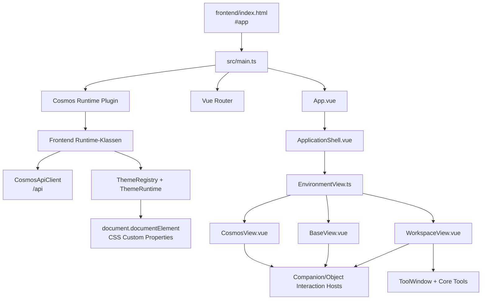

# Technischer Audit des aktuellen WebUI

- **Stand:** 25. Juli 2026
- **Audit-Basis:** Commit `80d74d22d68451154ea0a97497754ccf0a790060`
- **Geltungsbereich:** aktuelles WebUI in `frontend/`, einschließlich der Backend-Payloads, die sichtbare Darstellung steuern
- **Ziel:** belastbare Ausgangsbasis für eine spätere Theme Engine und einen visuellen Theme Builder
- **Nicht Bestandteil:** Implementierung, Refactoring, neue Features oder eine Änderung bestehender Interaktionsverträge

## 1. Kurzfazit

Das WebUI besitzt bereits eine kleine, funktionierende Theme-Basis: eine Registry, eine Runtime, einen DOM-Presenter und 23 globale CSS Custom Properties. Diese Schicht kontrolliert jedoch nur einen kleinen Teil des tatsächlichen Erscheinungsbilds. Der überwiegende Teil der visuellen Sprache liegt direkt in komponentenlokalem CSS und in berechneten Inline-Styles.

Die wichtigsten Befunde sind:

- Vue 3, Vue Router und Vite bilden eine kompakte SPA ohne externen Store und ohne UI-/Icon-Bibliothek.
- Anwendungszustand und Verhalten sind überwiegend sauber in eigenen Runtime-Klassen gekapselt. Lokaler, rein visueller oder transienter Zustand liegt in Vue-Komponenten.
- Die Umgebungen werden räumlich übereinandergeschichtet: Cosmos bleibt unter Base aktiv, Cosmos und Base bleiben unter einem Workspace aktiv.
- Cosmos Map, Base, Räume, Companion, Ship/Base-Zugang und Workspace-Furniture sind vollständig aus HTML, CSS, Pseudo-Elementen und einem dynamischen SVG aufgebaut. Die vorhandenen Referenz-PNGs werden nicht zur Laufzeit verwendet.
- Im Frontend existieren 474 Farb-Literal-Vorkommen (`#...`, `rgb(...)`, `rgba(...)`); 455 davon liegen außerhalb der Theme-Definition. Das sind 391 unterschiedliche textuelle Farbwerte.
- Sieben der 23 vorhandenen Theme-Tokens werden aktuell außerhalb der Definition gar nicht verwendet.
- `skin`, `icon`, `overlay`, `atmosphere` und `themeOverride` sind bereits Datenfelder, aber nur teilweise oder gar nicht an Renderer gekoppelt.
- Ein Objekt-Template-, Environment-Template-, Renderer- oder Asset-Slot-Vertrag existiert noch nicht.
- Funktion und Darstellung sind besonders in `CosmosView.vue`, `BaseView.vue` und `WorkspaceView.vue` vermischt.
- Der aktuelle Workspace erzeugt eine kritische Kopplung zwischen Theme-CSS und Fensterfunktion: `backdrop-filter` an der Workspace-Hülle etabliert im Browser einen Containing Block für `position: fixed`. Runtime-Koordinaten werden dadurch visuell nochmals um den Workspace-Offset verschoben und können geclippt werden.
- Die Fenster-Z-Reihenfolge ist nicht begrenzt: `z-index = 40 + focusOrder`, während `focusOrder` monoton wächst. Nach genügend Fokuswechseln können Tool Windows Tool Area, Workspace-Header, Context Menu oder Dialog überholen.

Für die spätere Theme Engine reicht daher keine Ausweitung der heutigen Farbtoken. Benötigt werden klar getrennte Verträge für:

1. semantische, typisierte Design-Tokens,
2. unveränderliche Object Templates und Hitboxen,
3. austauschbare Environment Templates,
4. Renderer für datengetriebene/prozedurale Objekte,
5. validierte Asset Slots,
6. eine Preview-/Transaktionsschicht des Theme Builders, die keine Runtime-Daten oder Interaktionen verändert.

## 2. Methodik und Abgrenzung

Untersucht wurden:

- alle Dateien unter `frontend/src/`,
- Vite-, TypeScript- und Package-Konfiguration,
- relevante Backend-Services und Seed-Daten für Projects, Base, Rooms, Workspaces und Tools,
- vorhandene visuelle Spezifikationen als Soll-Kontext,
- die laufende Anwendung bei 1280 × 720 Pixeln in Cosmos, Quick Travel, Main Room, Workshop, Workspace, Tool Windows, Context Menu und Object Window.

Die Browser-Prüfung diente nur der visuellen und geometrischen Verifikation. Es wurden keine Source-Dateien oder Konfigurationen verändert. Laufzeitwerte wie Workspace-Sessions sind nicht Bestandteil des Repository-Audits.

Zählregeln für das Styling-Inventar:

- Farb-Literale umfassen `#...`, `rgb(...)` und `rgba(...)`.
- Vorkommen in Tests wurden ausgeschlossen.
- CSS-Variablen und datengetriebene Farben werden zusätzlich separat bewertet.
- Werte in `frontend/src/themes/cosmos.ts` zählen als Literale, sind dort aber absichtlich zentralisiert.

## 3. Aktuelle Architektur

### 3.1 Laufzeitfluss

### 3.2 Framework und Build

| Aspekt | Aktueller Zustand | Relevanz für Theme Engine |
|---|---|---|
| Framework | Vue 3.5, Composition API, Single File Components | Theme-Kontext kann über Plugin/Injection oder CSS Scopes angebunden werden. |
| Routing | Vue Router 4.5 mit Web History; Memory History in Tests/SSR-Kontext | Theme-Wechsel darf Navigation und Environment-Transitions nicht verändern. |
| Build | Vite 6, separater App-Build und ES-Library-Build | Theme-Verträge müssen sowohl in der App als auch im exportierten Frontend-Runtime-Paket funktionieren. |
| Sprache | TypeScript 5.9, strict, `vue-tsc` | Typisierte Token-, Template-, Renderer- und Asset-Verträge sind möglich und empfehlenswert. |
| State | Vue `reactive`/`readonly` in Runtime-Klassen; `ref`/`computed` in Views | Kein Pinia/Vuex. Theme-State sollte in die bestehende Runtime-Architektur passen. |
| UI-Bibliothek | keine | Alle Primitives und Visuals sind Cosmos-eigen; eine Theme Engine muss die vollständige UI-Oberfläche abdecken. |
| Icon-Bibliothek | keine | Icons sind Textzeichen, Initialen oder CSS-Geometrie; Asset Slots fehlen. |

### 3.3 Entry Points

| Datei | Rolle |
|---|---|
| `frontend/index.html` | Statisches HTML, Mount-Ziel `#app`, Dark-Color-Scheme. |
| `frontend/src/main.ts` | Erzeugt Runtime und Router, installiert Plugin und globale Styles, mountet `App`. |
| `frontend/src/App.vue` | Delegiert vollständig an `ApplicationShell`. |
| `frontend/src/index.ts` | Public Library Entry für Runtime-Klassen und Typen; exportiert derzeit keine UI-Komponenten oder Template-/Renderer-Verträge. |
| `frontend/vite.app.config.ts` | SPA-Build und Dev-Proxy `/api` → Backend. |
| `frontend/vite.build.config.ts` | Wiederverwendbarer ES-Library-Build mit externem Vue/Vue Router. |

### 3.4 Routing und Environment-Layering

| Route | Environment | Sichtbare Schichtung |
|---|---|---|
| `/` | `cosmos` | nur `CosmosView` |
| `/base` | `base` | `CosmosView(backgroundOnly, inert, aria-hidden)` unter `BaseView` |
| `/base/rooms/:roomId` | `room` | wie Base; `BaseView` wählt Main Room oder Workshop |
| `/workspaces/:workspaceId` | `workspace` | Cosmos im Hintergrund, Base `backgroundOnly` darüber, Workspace aktiv darüber |
| Fallback | — | Redirect nach `/` |

`EnvironmentView.ts` lazy-loadet die drei großen Views. Die Hintergründe werden nicht durch Screenshots ersetzt, sondern als echte, weiter gemountete Views gerendert. `backgroundOnly` entfernt Vordergrundnavigation und Interaction Hosts; `inert` und `aria-hidden` werden als Fallthrough-Attribute am jeweiligen Root-Element angebracht.

Globale Layer:

| Ebene | Z-Wert | Quelle |
|---|---:|---|
| Cosmos | `auto` | `CosmosView.vue` |
| Base Stage | 10 | `BaseView.vue` |
| Workspace Stage | 20 | `WorkspaceView.vue` |
| Tool Windows | `40 + focusOrder` | `ToolWindow.vue` |
| Tool Area | 58 | `WorkspaceView.vue` |
| Workspace Header | 60 | `WorkspaceView.vue` |
| Workspace Status | 70 | `WorkspaceView.vue` |
| Context Menu | 160 | `ContextMenu.vue` |
| Interaction Error | 175 | `ObjectInteractionHost.vue` |
| Dialog | 190 | `CosmosDialog.vue` |

### 3.5 State Management

Es gibt keinen zentralen Store. `createCosmosFrontendRuntime()` erstellt einen Objektgraphen aus zustandsbehafteten Services:

| Runtime | Verantwortlichkeit |
|---|---|
| `ApplicationRuntime` | Startup, Theme-Aktivierung, Backend-Readiness |
| `ThemeRegistry` / `ThemeRuntime` | Theme-Registrierung, Fallback, Aktivierung und DOM-Tokens |
| `TransitionRuntime` | serialisierte Queue für Theme-, Environment-, Navigation- und Window-Transitions |
| `CosmosMapRuntime` | Snapshot, Kamera, Fokus, Selektion, Node-Positionen, Companion-Nachrichten |
| `BaseRuntime` | Base-/Room-Snapshot und selektierter Workspace Slot |
| `WorkspaceRuntime` | temporäre Workspace-Sessions und wiederherstellbarer Zustand |
| `WindowRuntime` | Rollen, Capabilities, Bounds, Fokus, Parent/Child und Constraints |
| `ToolRuntime` | Tool-Definitionen, Tool-Instanzen, Persistenz und Window-Kopplung |
| `ObjectInteractionRuntime` | Context Menu, Object Windows, Edit/Save |
| `NotificationRuntime` | Notifications und Companion-Indikator |
| `CoreToolsRuntime` | API-Fassade für Files, Archive, Capture, Review und Journeyman |

Der Runtime-State ist `readonly` nach außen. Komponenten rufen Methoden auf, statt State direkt zu mutieren. Das ist eine gute Grenze für die Theme Engine: Theme-Code sollte Presentation State konsumieren, aber keine fachlichen Runtime-Mutationen durchführen.

### 3.6 Aktuelles Styling-System

Das Styling besteht aus vier Ebenen:

1. `frontend/src/themes/cosmos.ts`: 23 globale `--cosmos-*`-Tokens.
2. `frontend/src/styles/main.css`: Reset, globale Typografie, Shell und gemeinsame Core-Tool-Primitives.
3. Scoped CSS in jeder `.vue`-Komponente: der Großteil von Form, Material, Farbe, Maße, Animation und Layering.
4. Berechnete Inline-Styles: Kamera, Node-/Project-Positionen, Window-Bounds, Context-Menu-/Dialog-Positionen und dekorative Zufallsverteilungen.

Der `DomThemePresenter` schreibt Token direkt auf `document.documentElement.style`, entfernt nicht mehr vorhandene Token und setzt `data-theme-object`. Es gibt aktuell:

- genau ein registriertes Theme (`cosmos.theme.cosmos`),
- keine Persistenz der Theme-Auswahl,
- keine typisierten Token,
- keine Token-Vererbung oder Varianten,
- keine Objekt-/Environment-Scopes,
- keine Asset-Auflösung,
- keine Live-Preview-Transaktion,
- keine Builder-History/Undo,
- keine Theme-Paket- oder Kompatibilitätsprüfung außer Name/Version/Namespace und nicht-leeren Werten.

## 4. Dateiübersicht

### 4.1 Shell, Routing, Theme und globale Styles

| Datei | Aufgabe | Theme-Relevanz |
|---|---|---|
| `frontend/src/main.ts` | Bootstrap von App, Router und Runtime | möglicher Installationspunkt für Theme-Kontext |
| `frontend/src/App.vue` | Root-Komponente | keine eigene Darstellung |
| `frontend/src/shell/ApplicationShell.vue` | Startup-, Failure- und Retry-Zustand | globale Surface-/Status-Tokens |
| `frontend/src/router/routes.ts` | Environment-Routen und Meta | funktional invariant |
| `frontend/src/router/index.ts` | History, Transition Queue, Dokumenttitel | funktional invariant |
| `frontend/src/views/EnvironmentView.ts` | Lazy Views und Layer-Komposition | Environment-Template-Grenze |
| `frontend/src/themes/cosmos.ts` | heutige Theme-Definition | Ausgangspunkt, nicht ausreichend |
| `frontend/src/runtime/themeRegistry.ts` | Registrierung und Minimalvalidierung | erweitern um Schema/Capabilities, später |
| `frontend/src/runtime/themeRuntime.ts` | Aktivierung und DOM-Presenter | spätere Theme-Orchestrierung |
| `frontend/src/styles/main.css` | globale Basis und Core-Tool-Styling | globale semantische Tokens und Primitives |

### 4.2 Views und zentrale UI-Komponenten

| Datei | Sichtbarer Verantwortungsbereich |
|---|---|
| `frontend/src/views/CosmosView.vue` | Map, Sterne, Project Galaxies, Nodes, Connections, Kamera, Quick Travel, Hosts |
| `frontend/src/components/cosmos/CosmosNavigation.vue` | Position Indicator, Nachbar-Travel |
| `frontend/src/components/cosmos/CosmosHomeHub.vue` | Companion-Zugang und Ship/Base-Zugang |
| `frontend/src/components/entities/CompanionAvatar.vue` | CSS-Renderer für Companion |
| `frontend/src/components/cosmos/CompanionWindowHost.vue` | Companion-Window-Lifecycle |
| `frontend/src/components/cosmos/CompanionConversation.vue` | Conversation-/Notification-Tabs und Nachrichten |
| `frontend/src/components/cosmos/NotificationCenter.vue` | Notification-Liste, Kategorien, Read-State |
| `frontend/src/views/BaseView.vue` | Base Stage, Room Shell, Cockpit, Door, Pet, Companion, Room-Wechsel |
| `frontend/src/components/base/WorkspaceFurniture.vue` | physische Workspace-Repräsentation und Slots |
| `frontend/src/views/WorkspaceView.vue` | Workspace Environment, Canvas, Tool Area, Tool-/Object-Hosts |
| `frontend/src/components/windows/ToolWindow.vue` | gemeinsame bewegbare/resizable Window-Hülle |
| `frontend/src/components/windows/ObjectWindow.vue` | Object Details/Edit/Appearance/Connections |
| `frontend/src/components/windows/ObjectInteractionHost.vue` | Context Menu, Object Windows, Dirty-Dialog, Fehler |
| `frontend/src/components/windows/ContextMenu.vue` | gruppierte Objektaktionen |
| `frontend/src/components/windows/CosmosDialog.vue` | modaler Bestätigungsdialog |
| `frontend/src/components/tools/FilesTool.vue` | Files Rail, Editor, Bildvorschau |
| `frontend/src/components/tools/ArchiveTool.vue` | Knowledge Rail und Inline-Editor |
| `frontend/src/components/tools/CaptureTool.vue` | Capture Modes, Draft, Attachments |
| `frontend/src/components/tools/ReviewTool.vue` | Review Queue und Entscheidungen |
| `frontend/src/components/tools/JourneymanTool.vue` | Tasks, Plan, Events, Provider-Hinweis |

### 4.3 Verhaltens- und Datenquellen

| Datei | Relevanter Vertrag |
|---|---|
| `frontend/src/runtime/cosmosMapRuntime.ts` | `MapCamera`, `MapProject`, `MapNode`, `MapConnection`; Zoom und Kollisionslogik |
| `frontend/src/runtime/baseRuntime.ts` | Base, Rooms, Slots, Workspace-Summaries, Companion und Pet |
| `frontend/src/runtime/workspaceRuntime.ts` | Definition, Session, Context, restorable State |
| `frontend/src/runtime/windowRuntime.ts` | Window-Rollen, Capabilities, Bounds und Fokus |
| `frontend/src/runtime/toolRuntime.ts` | Tool-Metadaten, Minimum Size, Window-Instanzen |
| `frontend/src/runtime/objectInteractionRuntime.ts` | Sections, Actions, Appearance Properties, Dirty/Save |
| `frontend/src/runtime/notificationRuntime.ts` | Kategorien, Read-State und Indikator |
| `frontend/src/runtime/applicationRuntime.ts` | Startup-Phasen |
| `frontend/src/runtime/transitionRuntime.ts` | serialisierte Transitionen |
| `frontend/src/runtime/apiClient.ts` | API-Transport und Fehlernormalisierung |
| `backend/src/cosmos/services/project_service.py` | Project-Farben/-Positionen und Root-Node-Skin |
| `backend/src/cosmos/services/base_service.py` | Räume, Slot-Placements/-Skins, Workspace-Icons/-Overlays |
| `backend/src/cosmos/services/core_tool_catalog.py` | Tool-Icons, Component Keys und Minimum Sizes |
| `backend/src/cosmos/services/schemas.py` | Property-Schemas für `skin`, `icon`, `overlay`, `theme_override`, `atmosphere` |
| `backend/src/cosmos/services/cosmos_map_service.py` | Map-Payload |
| `backend/src/cosmos/services/workspace_service.py` | Workspace-Definition und Environment Window |

Die zugehörigen `*.test.ts`-Dateien prüfen Runtime- und Router-Verträge, nicht die visuelle Token-/Template-Abdeckung. Visuelle Regressionstests oder Template-Contract-Tests existieren nicht.

## 5. Objektinventar und Trennung von Funktion/Darstellung

### 5.1 Cosmos Map und Project Galaxies

| Objekt | Zuständige Dateien | Verhalten und Abhängigkeiten | Darstellung, Position, Größe und Layer | Theme-Eignung |
|---|---|---|---|---|
| Cosmos Map Environment | `CosmosView.vue`, `cosmosMapRuntime.ts` | lädt `/cosmos/map`; Fokus, Selektion, Pan/Zoom, Pointer Capture; benötigt Router und Runtime | Full viewport; mehrere CSS-Gradienten, zwei Star-Layer und Pseudo-Elemente; `touch-action:none`; Layer `auto` | **Environment Template** plus optionale Background-Asset-Slots; Kamera-/Pointerlogik invariant |
| Distant/Near Stars | `CosmosView.vue` | rein dekorativ, `pointer-events:none` | wiederholte Radial-Gradienten; Insets `-12%`; Near Stars mit 80-s-Drift | direkt tokenisierbar oder Asset Slot; keine eigene Funktion |
| Project Galaxy | `CosmosView.vue`, `MapProject` | gruppiert sichtbare Nodes; aktiv über `focusedProjectId`, selected über Selection | Artikel hat 0 × 0 am Project-Ursprung; Nebula absolut um berechnete Node-Bounds; Default `--project-color` | **Object Template** + prozeduraler **Renderer**; Project-Farbe als validierter semantischer Parameter |
| Project Nebula | `CosmosView.vue` | keine Hitbox; reagiert auf active/selected | adaptive 420–640 × 340–520 World-Pixel; vier Gradienten, `color-mix`, Blur, 11-s-Animation | Renderer oder Asset Slot mit zwingend erhaltener Bounds-/Scale-Semantik |
| Node | `CosmosView.vue`, `cosmosMapRuntime.ts` | Select, Persist Selection, Drag, Persist Position, Root-Travel, Doppelklick-Open, Context Menu; Kollisionsregeln in Runtime | Button 80 × 80 World-Pixel, z 2, zentriert; tatsächliche Bildschirmgröße skaliert mit Kamera; Star-Größe nach Hierarchy | **Object Template** + **Node Renderer** + optionaler `skin`-Asset-Slot; alle Interaktionen invariant |
| Node Label | `CosmosView.vue` | Name und Hierarchy im Accessible Name | absolut unter Star; max. 190 px; Root größer; Textschatten | direkt tokenisierbar; Label-Region gehört zum Object Template |
| Connection | `CosmosView.vue`, `MapConnection` | rein visuelle Ableitung aus Endpoints; nur Intra-Project-Verbindungen werden gerendert | einziges Runtime-SVG; quadratische Bézierkurve; pro Connection ein SVG-Gradient; structural vs semantic/discovery | eigener **Connection Renderer**; Geometry/Endpoint-Vertrag invariant, Stroke-Style themable |
| Map Loading/Error | `CosmosView.vue` | Runtime-Phasen und Retry | z 12, zentriert; 44-px-Orbit bzw. Button | gemeinsame Status-Primitive + Tokens |
| Navigation Help | `CosmosView.vue` | sichtbar hervorgehoben, solange Space gehalten wird | fixed bottom 24, z 18; normal opacity 0,44, visible 1 | tokenisierbar; Text/Shortcut funktional invariant |

Besondere Kopplungen:

- `worldStyle` definiert exakt `translate(...) scale(...)`; die Reihenfolge ist Teil des Kamera-Vertrags.
- `projectStyle` berechnet Nebula-Größe und schreibt `--project-color` sowie vier Geometrievariablen inline.
- `nodeStyle` schreibt World-Koordinaten inline.
- `visibleNodes()` zeigt global Root plus maximal neun Preview Nodes, im fokussierten Project alle Nodes.
- Das Backend-Feld `skin` ist editierbar und wird geladen, vom aktuellen Node-Renderer aber nicht ausgewertet.
- Project-Farbe ist ein frei editierbarer String und gelangt ohne Frontend-Typvalidierung in Custom Property, SVG-Stop und Quick-Travel-Style.

### 5.2 Navigation, Quick Travel, Companion und Base-Zugang

| Objekt | Dateien | Funktion | Darstellung/Hitbox/Layer | Theme-Eignung |
|---|---|---|---|---|
| Position Indicator | `CosmosNavigation.vue` | zeigt aktuellen Project-Fokus; öffnet Quick Travel | fixed top 14, z 20; Nav bis 720 px; Current Button min. 210 px, Höhe im Test 53 px | **Object Template**, Icons/Mark als Asset Slots möglich; Tokens für Material/Typo |
| Neighbor Travel | `CosmosNavigation.vue` | geografisch links/rechts sortierte Projects | flexible Textbuttons, Pointer nur auf Buttons; Pfeile `‹`/`›` als Text | Template + Icon Slots; Nachbarlogik invariant |
| Quick Travel | `CosmosView.vue` | globaler Fokus oder Project Travel; schließt bei Auswahl | fixed top 88, z 24; Breite `min(390px, 100vw - 36px)`; Zeilen min. 58 px; Close 28 px | eigenes Overlay-Template; Project-Mark als renderer-/assetfähiger Slot |
| Companion Home Object | `CosmosHomeHub.vue`, `CompanionAvatar.vue` | öffnet Companion Window; zeigt Notification Badge | Button clamp 90–118 px, z 2; CSS-Avatar, 6-s-Float | **Companion Renderer** oder geriggtes Asset-Set; Hitbox invariant |
| Ship / Base-Icon | `CosmosHomeHub.vue` | einzige sichtbare globale Navigation zur Base | Button clamp 180–250 × 108–166 px; vollständig CSS-gezeichnet; Label „Base“ nur Hover/Focus | **Object Template** + Ship/Base-Asset-Slot oder eigener Renderer; Route invariant |
| Home Hub | `CosmosHomeHub.vue` | gruppiert Companion und Ship | fixed rechts/unten, z 22; Container pointer-none, Buttons pointer-auto | Environment-Anchor-Template |
| Companion Badge | `CompanionAvatar.vue`, `NotificationRuntime` | sichtbar, wenn ungelesene Notification existiert | `!`, Kreis oben rechts, z 8 | Badge Template + Status-Token; Semantik invariant |

Es gibt kein separates Base-Icon im Sinn einer Icon-Komponente. Der Base-Zugang ist die CSS-gezeichnete Ship-Silhouette. Die Tooltip-/Label-Funktion darf bei einem Asset-Austausch nicht verloren gehen.

### 5.3 Base und Rooms

| Objekt | Dateien | Funktion und States | Darstellung/Hitbox/Layer | Theme-Eignung |
|---|---|---|---|---|
| Base Stage | `BaseView.vue`, `BaseRuntime` | lädt `/base`, hält Main/Workshop, Selection; Cosmos bleibt darunter | Full viewport, z 10, halbtransparente Space-Fläche | äußeres **Environment Template**; Load-/Route-Vertrag invariant |
| Base Environment | `BaseView.vue` | Context Menu auf freier Fläche; `backgroundOnly` unter Workspace | 80 vw × 80 vh, min-height 575 px, zentriert; bei 1280 × 720: 1024 × 576 | **Environment Template**; unterstützte 80-%-Geometrie explizit versionieren |
| Room Shell | `BaseView.vue` | rein dekorativ | Ceiling, Floor, Walls, Beams, Bays, Lights als CSS-DOM; viele Clip Paths/Gradienten; interne z 1–3 | **Environment Template** mit Material-/Light-Tokens und optionalen Asset Slots |
| Main Room | `BaseView.vue` | Standardroute `/base` | dunkle/warm beleuchtete CSS-Variante | Environment-Variante |
| Workshop | `BaseView.vue` | `/base/rooms/workshop`; vier leere Slots | hellere Material-Overrides, Workshop Sign | Environment-Variante; `atmosphere` wird derzeit ignoriert |
| Cockpit | `BaseView.vue` | sichtbar, nicht interaktiv | top 7 %, left/right 20 %, height 54 %, z 3; Window, Stars, Nebula, Console, Seats | eigenes Object/Environment Template; Asset Slots möglich |
| Close Base | `BaseView.vue` | Router nach `/` | 32 × 32 px, top/right 14/15, z 30 | Control Template + Close-Icon-Slot |
| Room Door | `BaseView.vue` | wechselt Main ↔ Workshop und löscht Selection | Button 116 px breit, z 11; Frame 84 × 126 px; Text darunter | **Object Template** + Door-Renderer/Asset Slot; Route invariant |
| Workshop Sign | `BaseView.vue` | rein informativ | 230 px breit, top 12 %, z 4 | direkt tokenisierbar/Environment-Slot |
| Selection Note | `BaseView.vue` | zeigt selektierten Slot und Opening/Available | bottom 2,5 %, z 18, Pill | Status-Template; Text aus State |
| Base Loading/Error | `BaseView.vue` | Phase und Retry | z 2; 36-px-Spinner | gemeinsame Status-Primitive |

Die Sternpositionen der Base und des Cockpits werden deterministisch aus dem Schleifenindex berechnet und als Inline-Styles gesetzt. Das ist Darstellungscode in der View, kein Environment-Renderer-Vertrag.

### 5.4 Workspaces als Furniture und Slots

| Objekt | Dateien | Funktion und Daten | Darstellung/Hitbox/Layer | Theme-Eignung |
|---|---|---|---|---|
| Workspace Furniture | `WorkspaceFurniture.vue`, `BaseView.vue`, `baseRuntime.ts` | Slot-Selektion; zugewiesenes Furniture navigiert zum Workspace; Context Menu nutzt Workspace- oder Slot-ID | Button `clamp(180px,18vw,300px)` × `clamp(126px,19vh,210px)`, z 6; Drop Shadow | **Object Template** + Furniture Renderer + Asset Slots |
| Knowledge Desk | `WorkspaceFurniture.vue` | `skin=KnowledgeDesk` | grün/holzartige CSS-Variante, Monitor/Notizfläche | Skin Renderer/Asset-Set |
| Creation Workbench | `WorkspaceFurniture.vue` | `skin=CreationWorkbench` | amberfarbene Werkzeugmarken | Skin Renderer/Asset-Set |
| Workshop Bench | `WorkspaceFurniture.vue` | leere Slots | blau-graue Variante, dashed Screen bei unassigned | Skin Renderer/Asset-Set |
| Furniture Label | `WorkspaceFurniture.vue` | Workspace-Name oder „Empty Workspace“ | untere Labelregion im Button | typografisch tokenisierbar |
| Placement | `BaseView.vue` + Backend `placement` | feste Room-Position: rear-left/right oder workshop left/right front/rear | Prozent-Offsets in `BaseView.vue`, nicht Teil der Furniture-Komponente | gehört in **Environment Template**, nicht ins Theme-Material |

Die Datenfelder werden inkonsistent genutzt:

- `slot.skin` steuert CSS-Klassen und damit drei bekannte Varianten.
- `slot.placement` steuert eine feste Selektorliste in `BaseView.vue`.
- `workspace.icon` wird in der physischen Repräsentation nicht verwendet.
- `workspace.overlay` beeinflusst später nur die Accent-Variante des offenen Workspace.
- unbekannte Skins/Placements erhalten keine definierte Fallback-Struktur außer dem allgemeinen Furniture-CSS.

### 5.5 Companion und Pet in der Base

| Objekt | Dateien | Funktion | Darstellung/Hitbox/Layer | Theme-Eignung |
|---|---|---|---|---|
| Seated Companion | `BaseView.vue`, `CompanionAvatar.vue` | öffnet Companion Window; Notification Badge | Button 132 × 194 px, z 12; Stuhl per Pseudo-Element, Avatar innen | eigener Renderer + Avatar-/Chair-Asset-Slots |
| Companion Avatar | `CompanionAvatar.vue` | Modi `compact` und `seated` | Helmet, Visor, Face, Eyes, Body aus verschachtelten Spans/CSS; Blink 6,5 s | Renderer; Mode/Notification als unveränderlicher State-Vertrag |
| Pet | `BaseView.vue` | Klick setzt Greeting 1,6 s | Button 84 × 70 px, z 13; CSS-Körper; Tail- und Hop-Animation | Object Template + Pet Asset/Animation Slots; Timerfunktion invariant |

### 5.6 Workspace Environment und Tool Area

| Objekt | Dateien | Funktion und States | Darstellung/Hitbox/Layer | Theme-Eignung |
|---|---|---|---|---|
| Workspace Stage | `WorkspaceView.vue` | lokal `idle/opening/ready/closing`, Fehler/Retry | Full viewport z 20 | Environment-Layer invariant |
| Workspace Environment Window | `WorkspaceView.vue`, `WorkspaceRuntime`, `WindowRuntime` | öffnet Session, restores Tools, schließt mit Save; Escape schließt | fixed, 90 vw × 88 vh, zentriert; bei 1280 × 720: 1152 × 634; nicht bewegbar/resizable | **Environment Template**; Bounds-/Session-Vertrag invariant |
| Workspace Header | `WorkspaceView.vue` | Context Menu; Identity; Close | 54 px hoch, z 60; Close 28 × 28 px | Header Object Template + Icon Slot |
| Workspace Canvas | `WorkspaceView.vue` | Host für Tool-/Object-Windows | inset top 54; Grid/Stars/Orbit Marks; `overflow:hidden` | Environment Template + Canvas Renderer/Asset Slots |
| Overlay Marks | `WorkspaceView.vue` | dekorativ; neun indexbasierte Marks | 190 × 116 px, inline Prozentposition/Opacity | Renderer oder Environment-Asset |
| Tool Area | `WorkspaceView.vue`, `ToolRuntime` | zeigt zugewiesene Tools, öffnet Instanzen | top/left 14, z 58, min-height 40; Toolbuttons min-height 30 | Object Template |
| Tool Icon | `WorkspaceView.vue` | `tool.icon.slice(0,1)` | 22 × 22 px; nur erster Buchstabe des Backend-Strings | zwingender **Asset Slot** mit Text-Fallback |

Workspace-Accent:

- Default `#75cfa9`.
- `CreationWorkbench` → amber.
- `GraphicsDesk` → violet.
- `KnowledgeDesk` fällt auf Default zurück.
- `themeOverride` wird von Runtime und View geladen, aber nie aktiviert.
- `overlay` wählt nur die Accent-Klasse; kein Overlay-Renderer oder Asset wird geladen.

### 5.7 Window-System

| Objekt | Dateien | Funktion | Darstellung/Hitbox/Layer | Theme-Eignung |
|---|---|---|---|---|
| Tool Window | `ToolWindow.vue`, `WindowRuntime`, `ToolRuntime` | Focus, Move, Resize in 8 Richtungen, Close, Persist Bounds | fixed; CSS min 320 × 240; Definition kann größer sein; z `40 + focusOrder` | unveränderliches **Window Object Template** + tokenisierte Skin |
| Window Header | `ToolWindow.vue` | Drag-Hitbox außer Close Button | min-height 42 px, Cursor move; Close 27 × 27 px | Template; Control Icon Slot |
| Resize Edges | `ToolWindow.vue` | Pointertracking an `window`; emit Move/Resize | N/S 8 px hoch, E/W 8 px breit, Corners 16 × 16 px | Hitbox ist funktionaler Template-Vertrag; Skin darf sie nicht verkleinern |
| Active/Inactive | `ToolWindow.vue`, `WindowRuntime` | genau ein Window active | inactive opacity 0,94; active stärkere Border/Shadow | direkt tokenisierbar |
| Object Window | `ObjectWindow.vue`, `ObjectInteractionRuntime` | Details/Edit/Appearance/Connections; Dirty/Save/Error | ToolWindow mit Minimum 420 × 380; eigene Tabs/Forms | Content-Template + gemeinsame Window-Skin |
| Context Menu | `ContextMenu.vue` | Actions gruppieren, Focus auf erstes Item, Outside/Escape Close | fixed 240 px, z 160; Items min-height 36; Clamp reserviert 252 × 330 | Overlay Object Template + Tokens/Icon Slot |
| Discard Dialog | `CosmosDialog.vue` | Dirty-Close bestätigen/abbrechen, Escape | Full-owner veil, z 190; Panel max. 440 px; Buttons min-height 36 | Dialog Object Template + Tokens |
| Interaction Error | `ObjectInteractionHost.vue` | Runtime-Fehler | fixed bottom/right 22, z 175 | Notification/Alert Primitive |

Window-Capabilities sind bereits sauber funktional definiert:

| Rolle | bewegbar | resizable | closable | borderless | Header |
|---|---:|---:|---:|---:|---:|
| Base Environment | nein | nein | ja | ja | nein |
| Room Environment | nein | nein | ja | ja | nein |
| Workspace Environment | nein | nein | ja | nein | ja |
| Tool | ja | ja | ja | nein | ja |
| Surface | nein | nein | ja | ja | nein |

Diese Matrix muss außerhalb der Theme Engine bleiben.

### 5.8 Companion Window, Notifications und Core Tools

| Objekt | Dateien | Funktion/States | Darstellung/Hitbox | Theme-Eignung |
|---|---|---|---|---|
| Companion Window | `CompanionWindowHost.vue`, `CompanionConversation.vue` | Open/Focus/Move/Resize/Close; Conversation/Notifications | max. 520 × 560, min. 360 × 360; rechts 54 px, top 92 | Tool Window Template + Companion Content Template |
| Conversation | `CompanionConversation.vue` | local messages, `sending`, Backend-Reply | Context row, Tabs, Message Bubbles, 42-px Input/Button | tokenisierbare Content-Primitives |
| Notification Center | `NotificationCenter.vue`, `NotificationRuntime` | loading/failed/empty/list, category filter, read/unread, destination | Header 44, Category Buttons 28, Entries full width | Notification Object Template + Status Tokens |
| Unread Marker | `NotificationCenter.vue` | `read=false` | 2-px Leiste + Glow | Status-/semantic token |
| Files | `FilesTool.vue`, `main.css` | list/grid state, search, create/edit/move/delete, image preview | 220-px Rail, Editor; native Prompt/Confirm für Move/Delete | Core-Tool Layout Template; native Dialoge sind Theme-Lücke |
| Archive | `ArchiveTool.vue`, `main.css` | search, select, edit, version save | 240-px Rail | Core-Tool Layout Template |
| Capture | `CaptureTool.vue`, `main.css` | Modes, Draft Saving, Attachments, Submit | Toolbar modes, flexible Editor | Core-Tool Layout Template |
| Review | `ReviewTool.vue`, `main.css` | queue, selection, decisions | 250-px Rail | Core-Tool Layout Template |
| Journeyman | `JourneymanTool.vue`, `main.css` | load/create/cancel, plan/events/provider states | Cards und Timeline | Core-Tool Layout Template |

Die Core Tools teilen globale `.core-tool*`-Klassen, enthalten aber weiterhin komponentenlokale hardcodierte Farben und Maße. `FilesTool` benutzt außerdem `window.prompt` und `window.confirm`; diese nativen Browserdialoge können von einer Cosmos Theme Engine nicht gestaltet werden.

## 6. State-Inventar

### 6.1 Globale und Environment-States

| Bereich | States | Sichtbare Repräsentation | Quelle |
|---|---|---|---|
| Application | `idle`, `loading_theme`, `checking_backend`, `ready`, `failed`, `stopped` | Startup Text oder Failure Card mit Retry | `ApplicationShell.vue`, `applicationRuntime.ts` |
| Transition | `environment`, `navigation`, `theme`, `window` aktiv oder settled | derzeit keine eigene sichtbare globale Transition-Komponente | `transitionRuntime.ts` |
| Cosmos Load | `idle`, `loading`, `ready`, `failed` | Orbit, Map oder Error/Retry | `CosmosView.vue` |
| Map Camera | x, y, zoom 0,35–2,4 | Transform der World | `cosmosMapRuntime.ts` |
| Project | default, focused/active, selected | Nebula-Brightness/Opacity | `CosmosView.vue` |
| Node | default, hover, focus-visible, selected, dragging | Star Scale/Glow, Selection Outline, grab/grabbing | `CosmosView.vue` |
| Map Interaction | Space held, camera drag, node drag | Help emphasis, deaktivierte Transform-Transition | `CosmosView.vue` |
| Quick Travel | open/closed; current item | Panel und `aria-current` | `CosmosView.vue` |
| Base Load | `idle`, `loading`, `ready`, `failed` | Spinner/Room/Error | `BaseView.vue` |
| Room | `main`, `workshop`; ungültig → Redirect | unterschiedliche Environment-CSS | `BaseView.vue` |
| Slot | default, assigned/unassigned, hover, focus, selected/opening | Screen-/Border-/Selection-Varianten und Note | `WorkspaceFurniture.vue`, `BaseView.vue` |
| Pet | default, hover/focus, greeting | Label/zweifacher Hop | `BaseView.vue` |
| Workspace View | `idle`, `opening`, `ready`, `closing`, error | Status oder Environment | `WorkspaceView.vue` |
| Workspace Session | `created`, `initialized`, `active`, `background`, `closed` | nur active Workspace wird gerendert; Runtime-Vertrag breiter | `workspaceRuntime.ts` |

### 6.2 Window-, Object- und Tool-States

| Bereich | States | Darstellung |
|---|---|---|
| Window | `active`, `inactive`, `closed` | Active Border/Shadow/Opacity; closed entfernt |
| Window Gesture | idle, moving, resizing N/NE/E/SE/S/SW/W/NW | Cursor und laufende Bounds-Änderung; keine eigene Klasse |
| Object Window Section | `details`, `edit`, `appearance`, `relationships` | Tab-Inhalt |
| Object Draft | clean/dirty, saving, error | Footer, disabled Buttons, Error |
| Context Menu | loading, open, closed; Action enabled/disabled | Menu bzw. disabled Opacity |
| Dirty Close | none/pending | CosmosDialog |
| Notification | loading, failed, empty, list; read/unread; category filter | Status, Entry-Leiste, Tabs |
| Companion | conversation/notifications; sending/idle; user/companion/error reply | Tabs, disabled Form, Bubble-Varianten |
| Tool Instance | active/background; available/unavailable; open/closed | Window Active State; unavailable IDs haben keine sichtbare UI |
| Capture | quick/rant/form/file; draft saving/saved/error; submitting | pressed Modes, Status, disabled Submit |
| Files | loading/ready/error; list/grid; creating/selected/empty; editable/image/binary | unterschiedliche Tool-Inhalte |
| Archive | query, selected/empty, save/error | Rail und Editor |
| Review | selected/empty/error; Review-Fachstates aus Backend | Rail, Evidence, Actions |
| Journeyman | queued/executing/awaiting_provider/weitere Backend-States | Task, Cancel und Provider-Hinweis |

### 6.3 Bereits spezifizierte, aber aktuell nicht oder nur teilweise visualisierte States

- Cosmos „search result“ und „selected destination“ besitzen keine eigenständigen Klassen.
- Workspace „opened“ wird indirekt durch Route und Background-Selection Note gezeigt.
- Window „opening“ ist nur bei Workspace/Context Menu/Dialog animiert, nicht als gemeinsamer Window-State.
- Window „closing“, „moving“ und „resizing“ besitzen keine gemeinsamen visuellen State-Klassen.
- `WorkspaceSessionState.background` ist vorhanden, die aktuelle Route rendert jedoch nur eine lokale `session`.
- `unavailableDefinitionIds` und `ToolRuntime.state.error` haben keine dedizierte sichtbare Anzeige im Tool Area.
- `themeOverride`, Room-`atmosphere` und Node-`skin` besitzen Datenstates, aber keinen vollständigen visuellen Rendererpfad.

## 7. Hitbox-Inventar

Die folgenden Maße sind CSS-/Logikmaße. World-Objekte der Cosmos Map werden mit dem Kamera-Zoom skaliert.

| Hitbox | Maß/Regel | Position/Constraint | Bemerkung |
|---|---|---|---|
| Cosmos Map | gesamter Viewport | absolute inset 0 | Wheel immer; Pan nur Space + linker Pointer |
| Node Button | 80 × 80 World-px | um Node-Koordinate zentriert | bei Zoom 0,52 im Test ca. 41,6 × 41,6 px |
| Node Star | Detail 8, Default 13, Domain/Cluster 20, Root 38 World-px | Mitte der Node-Hitbox | rein visuelle Kernfläche |
| Project Article | 0 × 0 | Project-Ursprung | kein eigener sinnvoller Hitbereich |
| Cosmos Nav | bis 720 px breit | fixed top 14, horizontal zentriert | Container pointer-none |
| Current Location | min. 210 px, Testhöhe 53 px | mittlere Nav-Spalte | öffnet Quick Travel |
| Neighbor Buttons | flexible Nav-Spalten | links/rechts | Textbreite kann gekürzt werden |
| Quick Travel | max. 390 px breit; max. 520 px hoch | top 88, zentriert | Close 28 × 28; Row min. 58 |
| Companion Home | clamp 90–118 px quadratisch | Home Hub rechts/unten | float transform verändert gemalten Bereich |
| Ship/Base | clamp 180–250 × 108–166 px | Home Hub rechts/unten | vollständiger Button ist klickbar |
| Base Stage | gesamter Viewport | z 10 | aktiver Overlay-Layer |
| Base Environment | 80 vw × 80 vh; min-height 575 | zentriert | kein min-width |
| Base Close | 32 × 32 | top 14/right 15 innerhalb Base | kleiner als 44-px-Touchziel |
| Workspace Furniture | clamp 180–300 × 126–210 | Environment-Placement | gesamte Möbelbox klickbar |
| Seated Companion | 132 × 194 | bottom 10 %, center | gesamte Stuhl-/Avatarbox |
| Pet | 84 × 70 | right 30 %, bottom 11 % | gesamte transparente Box |
| Room Door | 116 px breit; Inhalt ca. 163 px hoch | right 2,5 %, bottom 11 %; Workshop zentriert | Frame 84 × 126 |
| Workspace Environment | 90 vw × 88 vh | fixed zentriert | Runtime-Bounds entsprechen Viewport-Koordinaten |
| Workspace Close | 28 × 28 | Header rechts | kleiner als 44-px-Touchziel |
| Tool Area Buttons | min-height 30 | innerhalb 40-px-Leiste | Icons 22 × 22 |
| Tool Window Header | min-height 42 | gesamte Headerbreite außer Button | Move-Hitbox |
| Tool Close | 27 × 27 | Header rechts | Pointerdown stoppt Move |
| Resize N/S | 8 px hoch, 18 px Corner-Abstand | Rand | unsichtbar |
| Resize E/W | 8 px breit, 18 px Corner-Abstand | Rand | unsichtbar |
| Resize Corners | 16 × 16 | vier Ecken | SE als einzige sichtbare Grip-Grafik |
| Context Menu | 240 px breit | Owner-Clamp mit 12-px-Inset | Items min-height 36 |
| Dialog Veil | gesamter Owner oder Viewport | fixed | Self-Click cancel |
| Dialog Panel | `min(440px,100%)` | zentriert | Footer Buttons min-height 36 |
| Companion Form | Input und Button min-height 42 | Window Footer | nahe am 44-px-Ziel |
| Notification Category | min-height 28 | horizontal scrollbare Nav | klein |
| Notification Entry | volle Listenbreite + Padding | Liste | gesamte Entry-Fläche klickbar |

Browser-Verifikation bei 1280 × 720:

- Base Environment: 1024 × 576 bei x 128/y 72.
- Furniture: ca. 230 × 137.
- Workspace Environment: 1152 × 634 bei x 64/y 43.
- Tool Windows: 760 × 534.
- Quick Travel: 390 × 298; Einträge 372 × 58.

## 8. Styling-Inventar

### 8.1 Vorhandene Theme-Tokens

| Gruppe | Tokens | Nutzung |
|---|---|---|
| Background/Surface | `background`, `surface`, `surface-raised`, `surface-muted`, `metal` | `surface-muted` und `metal` unbenutzt |
| Border | `border`, `border-strong` | in globalen Primitives und Overlays genutzt |
| Text | `text`, `muted`, `faint` | relativ breit genutzt |
| Accents | `accent`, `violet`, `green`, `amber`, `danger` | nur `accent` genutzt; vier semantische Accents unbenutzt |
| Glow | `glow-cyan`, `glow-amber` | nur cyan einmal genutzt |
| Window | `window-shadow`, `window-shadow-active`, `surface-blur` | von Window/Overlay/Workspace genutzt |
| Radius | `radius-window`, `radius-control` | relativ breit genutzt |
| Motion | `transition-duration` | nur Shell und Tool Window |

Die Nutzung ist ungleichmäßig. Komponenten greifen häufig auf ähnliche, aber neue Literale zurück, statt vorhandene Tokens zu verwenden.

### 8.2 Lokale Custom Properties

| Property | Quelle | Zweck |
|---|---|---|
| `--project-color` | `CosmosView.vue` | datengetriebene Project-/Node-/Connection-Farbe |
| `--nebula-left/top/width/height` | `CosmosView.vue` | berechnete Nebula-Geometrie |
| `--workspace-accent` | `WorkspaceView.vue` | Overlay-spezifischer Workspace-Akzent |
| `--furniture-accent` | `WorkspaceFurniture.vue` | Skin-spezifischer Möbelakzent |

Diese Properties sind gute Keime für Renderer-Parameter, aber noch kein formaler Vertrag.

### 8.3 Fest verdrahtete Gestaltung

| Kategorie | Befund |
|---|---|
| Farb-Literale | 474 Vorkommen, davon 455 außerhalb `themes/cosmos.ts`; 391 unterschiedliche textuelle Werte |
| Gradienten | 91 Vorkommen |
| Inline-Style-Bindings | 11 |
| Z-Index-Deklarationen | 38 plus dynamisches `40 + focusOrder` |
| `animation:` | 22 |
| `@keyframes` | 17 |
| SVG | ein dynamisches SVG für Connections |
| Runtime-Bilder | ein `` für Files-Preview aus `dataUrl` |
| externe UI-Assets | keine |

Größte Literal-Konzentration:

| Datei | Farb-Literale | Gradienten | Z-Indizes |
|---|---:|---:|---:|
| `BaseView.vue` | 114 | 30 | 15 |
| `CosmosView.vue` | 48 | 20 | 4 |
| `CompanionAvatar.vue` | 41 | 10 | 4 |
| `ObjectWindow.vue` | 40 | 0 | 0 |
| `WorkspaceFurniture.vue` | 39 | 9 | 1 |
| `WorkspaceView.vue` | 34 | 10 | 4 |
| `CosmosHomeHub.vue` | 25 | 6 | 4 |
| `main.css` | 24 | 1 | 0 |

### 8.4 Inline-Styles

| Datei | Inline-Inhalt | Klassifikation |
|---|---|---|
| `CosmosView.vue` | World Transform | funktionale Geometrie, muss Renderer-/Template-owned bleiben |
| `CosmosView.vue` | Project Origin, Farbe, Nebula Bounds | gemischt: funktionale Geometrie + Darstellung |
| `CosmosView.vue` | Node Position | funktionale Geometrie |
| `CosmosView.vue` | Quick-Travel-Punktfarbe/-Glow | Darstellung, direkt token-/rendererfähig |
| `BaseView.vue` | 14 Base-Sterne | Darstellung |
| `BaseView.vue` | 24 Cockpit-Sterne | Darstellung |
| `WorkspaceView.vue` | Environment Bounds | funktionale Geometrie |
| `WorkspaceView.vue` | neun Overlay Marks | Darstellung |
| `ToolWindow.vue` | Bounds und Z-Index | funktionale Geometrie/Layer |
| `ContextMenu.vue` | Clamp-Position | funktionale Geometrie |
| `CosmosDialog.vue` | Owner Bounds | funktionale Geometrie |

### 8.5 Icons und Assets

Aktueller Zustand:

- keine Icon-Komponenten,
- keine Icon Fonts,
- kein SVG-Icon-Set,
- keine produktiv geladenen PNG/JPG/WebP-Assets,
- keine Asset Registry,
- keine Asset-Slot-IDs,
- keine Auflösungs-/Fallback-/Caching-Regeln.

Fest eingebaute Icons/Symbole:

- Close: Textzeichen `×`,
- Navigation: `‹` und `›`,
- Context Menu: `›`,
- Tool Icons: erster Buchstabe von `tool.icon`,
- Workspace Identity: CSS-Diamant,
- Project/Node: CSS-Kreise und Glows,
- Companion, Ship, Pet, Furniture, Door, Cockpit: CSS-Geometrie.

Die PNGs unter `docs/Visual_Specifications_V1/Graphic_Templates/` sind Referenzbilder und werden von der App nicht geladen. Das Repository-Verzeichnis `assets/` enthält keine verwendeten WebUI-Assets.

### 8.6 Animationen

| Animation | Objekt | Dauer/Charakter |
|---|---|---|
| `stellar-drift` | Near Stars | 80 s linear infinite |
| `nebula-breathe` | Project Nebula | 11 s alternate |
| `node-pulse` | Node Star | 4,8 s |
| `orbit` | Map Loader | 1,2 s |
| `base-arrival` | Base Environment | 520 ms |
| `star-breathe` | Base Stars | 4 s |
| `pet-tail` | Pet | 3,8 s |
| `pet-hop` | Greeting | 440 ms × 2 alternate |
| `workspace-open` | Workspace | 360 ms |
| `spin` | Base/Workspace Loader | 1,1–1,2 s |
| `companion-blink` | Companion | 6,5 s |
| `companion-float` | Home Companion | 6 s |
| `ship-hover` | Ship | 7 s |
| `context-menu-open` | Context Menu | 120 ms |
| `dialog-veil/open` | Dialog | 140/160 ms |

Die großen Ambient-Animationen berücksichtigen überwiegend `prefers-reduced-motion`. Nicht vollständig abgedeckt sind unter anderem alle lokalen Hover-/Transition-Dauern, Navigation, Message UI und Tool-Window-Transitions.

## 9. Theme-Eignungsmatrix

Legende:

- **Token**: direkt über semantische Tokens steuerbar
- **OT**: benötigt ein stabiles Object Template
- **ET**: benötigt ein Environment Template
- **Renderer**: benötigt eigene daten-/stategetriebene Rendering-Logik
- **Asset**: sollte einen validierten Asset Slot erhalten
- **Invariant**: Verhalten/Geometrievertrag darf durch Themes nicht verändert werden

| Objekt | Token | OT | ET | Renderer | Asset | Invariant |
|---|---:|---:|---:|---:|---:|---|
| Cosmos Background | ja | — | ja | optional | ja | Viewport und Kamera-Layer |
| Star Fields | ja | — | ja | optional | ja | pointer-none |
| Project Galaxy/Nebula | ja | ja | — | ja | optional | Project-Ursprung und adaptive Bounds |
| Nodes | ja | ja | — | ja | ja | 80-px-Hitbox, Drag/Select/Open |
| Connections | ja | ja | — | ja | optional | Endpoints, Provenance, Pointer-none |
| Position Indicator | ja | ja | — | optional | ja | Travel/Quick-Travel-Semantik |
| Quick Travel | ja | ja | — | — | ja | Auswahl-/Fokuslogik |
| Companion | ja | ja | — | ja | ja | Open/Notification/Mode |
| Ship/Base-Zugang | ja | ja | — | ja | ja | Route `/base` |
| Base/Main Room | ja | — | ja | optional | ja | 80-%-Environment und Layer |
| Workshop | ja | — | ja | optional | ja | Room-ID/Route |
| Cockpit | ja | ja | ja | optional | ja | nicht interaktiv |
| Furniture/Slots | ja | ja | ja für Placement | ja | ja | Slot-ID, Assignment, Open |
| Pet | ja | ja | — | ja | ja | Greeting-Interaktion |
| Door | ja | ja | ja für Placement | ja | ja | Room-Wechsel |
| Workspace Environment | ja | ja | ja | — | ja | Session, Bounds, fixed Capabilities |
| Tool Area | ja | ja | — | — | ja | Tool Assignment/Open |
| Tool Window | ja | ja | — | — | ja | Move/Resize/Close/Bounds |
| Object Window | ja | ja | — | — | ja | Sections/Edit/Dirty/Save |
| Context Menu | ja | ja | — | — | ja | Actions/Focus/Close |
| Dialog | ja | ja | — | — | ja | Modal-/Owner-Vertrag |
| Companion Conversation | ja | ja | — | — | optional | Message-/Send-Semantik |
| Notifications | ja | ja | — | — | ja | Read/Destination |
| Core Tools | ja | ja | — | bei Spezialviews | ja | Tool-Funktionen und API |
| Labels/Status | ja | ja | — | — | optional | Inhalt, ARIA und State |

## 10. Risiken

### 10.1 Kritisch

#### R1: Theme-CSS kann Window-Geometrie funktional verändern

`workspace-environment` verwendet `backdrop-filter: blur(22px)` und `overflow:hidden`. Browser behandeln einen gefilterten Vorfahren als Containing Block für darin liegende `position: fixed`-Elemente. Tool Windows, Context Menu und Dialog erhalten jedoch Bounds, die als Viewport-Koordinaten berechnet werden.

Im Browser-Audit:

- Workspace Bounds: x 64/y 43.
- Tool Inline-Style: left 174/top 139.
- tatsächlicher Tool-Rect: x 239/y 183, also ungefähr plus Workspace-Offset und Border.
- Context Menu Inline-Style: left 640/top 71.
- tatsächlicher Rect: x 705/y 115.

Eine Theme-Änderung, die `backdrop-filter`, `filter`, `transform`, `contain` oder ähnliche Eigenschaften hinzufügt/entfernt, kann deshalb Koordinaten, Parent-Clamping und Clipping ändern. Presentation und Funktion sind hier nicht getrennt.

#### R2: Unbegrenzter dynamischer Z-Index

`WindowRuntime.nextFocusOrder` wächst monoton. `ToolWindow` setzt `zIndex: 40 + focusOrder`. Dadurch kann ein häufig fokussiertes Window feste UI-Layer überholen:

- ab Fokusordnung 19: Tool Area z 58,
- ab 21: Workspace Header z 60,
- ab 120: Context Menu z 160,
- ab 150: Dialog z 190.

Eine Theme Engine darf diesen Fehler nicht durch neue Z-Literale verdecken. Benötigt wird später ein formaler Layer-Vertrag mit begrenzter Renormalisierung.

#### R3: Theme deckt nur einen kleinen Teil der tatsächlichen Gestaltung ab

455 Farb-Literal-Vorkommen außerhalb der Theme-Datei, 91 Gradienten und 17 Keyframe-Blöcke bedeuten, dass ein „neues Theme“ heute hauptsächlich dieselbe Cosmos-Skin mit wenigen geänderten globalen Farben wäre.

### 10.2 Hoch

#### R4: View-Komponenten mischen Fachinteraktion, Geometrie und Skin

`CosmosView.vue` (890 Zeilen), `BaseView.vue` (725) und `WorkspaceView.vue` (390) enthalten jeweils:

- Runtime-Zugriff,
- Router-Aktionen,
- Pointer-/Keyboard-Verhalten,
- Geometrieberechnung,
- Markup des Object Templates,
- vollständige Theme-Skin,
- Animationen.

Ein visueller Builder könnte diese Bereiche nicht sicher austauschen, ohne Interaktionscode zu berühren.

#### R5: Datenfelder versprechen mehr Theme-Flexibilität als der Renderer liefert

- Node `skin`: geladen/editierbar, ignoriert.
- Workspace `icon`: geladen, in Furniture und Tool Area nicht als Icon gerendert.
- Workspace `overlay`: nur als Klassenname für drei Accent-Fälle genutzt.
- Workspace `themeOverride`: geladen, ignoriert.
- Room `atmosphere`: geladen, ignoriert.
- unbekannte Skin-/Overlay-Werte: kein expliziter Renderer-Fallbackvertrag.

#### R6: Keine Asset-Sicherheits- und Fallback-Grenze

Ein Builder braucht Regeln für Asset-Typ, Dimensionen, Dateigröße, Transparenz, Animation, URL-/Bundle-Herkunft, Fallback und Caching. Heute existiert nur Files-Preview per Data URL; das ist kein Theme-Asset-System.

#### R7: Erscheinungswerte sind untypisierte Strings

Theme-Tokens und Project-Farben sind freie Strings. Es gibt keine Unterscheidung zwischen Color, Length, Duration, Shadow, Font, Image oder Enum und keine Bereichs-/Kontrastvalidierung. Ein visueller Builder könnte ungültige oder funktional gefährliche CSS-Werte erzeugen.

#### R8: Mehrere echte Environments bleiben gemountet

Im Workspace laufen Cosmos und Base als echte Background Views weiter. Neue Themes können durch teure Filter, Animationen oder globale Selektoren die Performance mehrfach belasten. `inert` schützt Interaktion, aber nicht Rendering-Kosten.

### 10.3 Mittel

#### R9: Kleine Controls und unsichtbare Hitboxen

Close Controls liegen bei 27–32 px, Kategorien bei 28 px. Resize-Hitboxen sind 8/16 px und überwiegend unsichtbar. Themes müssen sichtbare Form und unveränderliche Hitbox unterscheiden, sonst sinken Bedienbarkeit und Accessibility.

#### R10: Responsive Vertrag ist Desktop-only und implizit

`html/body/#app` erzwingen mindestens 1024 × 720. Viele Layouts verwenden feste Pixel, Prozentpositionen und `clamp`, aber keine umfassenden Breakpoints. Ein Theme darf nicht stillschweigend andere Mindestgrößen verlangen.

#### R11: Native Browserdialoge durchbrechen das Theme

Files verwendet `window.prompt` und `window.confirm`. Diese Oberflächen sind weder Cosmos-Templates noch themebar.

#### R12: Motion-System ist fragmentiert

Nur ein globaler Duration-Token existiert; die meisten 120-ms- bis 80-s-Werte sind lokal. Reduced-Motion-Abdeckung ist gut begonnen, aber nicht vollständig.

#### R13: Kein visueller Regression-/Contract-Test

Die Tests decken Runtime-Verhalten ab, aber nicht:

- Token-Vollständigkeit,
- Theme-Fallbacks je Objekt,
- Hitbox-Invarianz,
- Layer-Ordnung,
- Asset-Fallbacks,
- Reduced Motion,
- Kontrast,
- Screenshot-/Renderer-Regressions.

## 11. Konkrete Empfehlungen für die spätere Theme Engine

### 11.1 Verträge zuerst definieren

Vor visueller Erweiterung sollten vier getrennte, versionierte Verträge festgelegt werden:

1. **Functional Object Contract**
   IDs, States, Aktionen, ARIA, Events, Hitboxen, Bounds und Capabilities. Nicht vom Theme veränderbar.

2. **Object Template Contract**
   feste Regionen eines Objects, beispielsweise Node Hitbox/Visual/Label, Window Header/Content/Resize oder Notification Marker/Body/Time.

3. **Environment Template Contract**
   räumliche Anchors, Safe Areas, Slot Placements und Layer für Cosmos, Base/Rooms und Workspace.

4. **Theme Presentation Contract**
   typisierte Tokens, Renderer-Auswahl, Asset Slots, Material-/Motion-Profile und State-Skins.

### 11.2 Token-System semantisch und typisiert ausbauen

Empfohlene Token-Gruppen:

- globale Farben und Textrollen,
- Environment Background/Atmosphere,
- Object Surface/Border/Elevation,
- Window active/inactive/modal,
- Node je Hierarchy und State,
- Connection je Provenance,
- semantische Statusfarben,
- Typography-Rollen,
- Spacing/Radius,
- Hitbox-unabhängige Visual Sizes,
- Motion Duration/Easing/Amplitude,
- Blur/Opacity,
- Layer-Namen statt frei verteilter Zahlen.

Tokens sollten Typ, Default, zulässigen Bereich und Fallback besitzen. Werte wie Project-Farbe bleiben Objektdaten, werden aber vor Verwendung als Farbe validiert.

### 11.3 Object Templates aus den Views herauslösen

Priorität:

1. Window, Context Menu, Dialog und gemeinsame Controls,
2. Node, Connection und Project Galaxy,
3. Workspace Furniture, Door, Companion, Ship und Pet,
4. Navigation/Quick Travel,
5. Core-Tool-Primitives.

Die Templates sollen Events und ARIA besitzen; Themes liefern nur Visual Parts/Slots.

### 11.4 Environment Templates separat behandeln

Cosmos, Base Main Room, Workshop und Workspace Canvas benötigen eigene Environment-Templates. Sie dürfen:

- Background-/Material-Layer definieren,
- dekorative Asset Slots platzieren,
- freigegebene Anchors und Safe Areas verwenden,
- Slot-Placements abbilden.

Sie dürfen nicht:

- Routerziele ändern,
- Objects entfernen,
- Hitboxen überdecken,
- Window-Bounds transformieren,
- Capabilities verändern,
- `inert`/ARIA umgehen.

### 11.5 Renderer dort einsetzen, wo Tokens nicht reichen

Eigene Renderer sind sinnvoll für:

- Project Galaxy/Nebula,
- Node Skins,
- Connections,
- Companion,
- Ship,
- Pet,
- Furniture-/Door-Skins.

Renderer erhalten einen read-only `RenderContext` mit Object-Daten, State, Scale, Theme und Asset Resolver. Sie emittieren keine Runtime-Aktionen; diese bleiben am Template.

### 11.6 Asset Slots formal definieren

Empfohlene erste Slots:

- `cosmos.background`,
- `project.nebula`,
- `node.core`,
- `node.selection`,
- `navigation.previous/next/current`,
- `companion.avatar.*`,
- `companion.notification`,
- `base.ship`,
- `base.room.background`,
- `base.cockpit`,
- `workspace.furniture.*`,
- `room.door`,
- `window.close`,
- `tool.icon.*`,
- `context-menu.disclosure`,
- `status.loading/error/empty`.

Jeder Slot benötigt einen Code-native Fallback, damit ein unvollständiges Theme funktionsfähig bleibt.

### 11.7 Theme-Scopes einführen

Nicht alle Tokens sollten global auf `:root` liegen. Empfohlene Scopes:

- Root Theme,
- Environment (`cosmos`, `base`, `room`, `workspace`),
- Object Type,
- Object Instance Override,
- State.

`themeOverride` eines Workspace kann dann bewusst auf dessen Environment-Root angewendet werden, ohne Cosmos und Base mitzunehmen.

### 11.8 Geometry-/Containing-Block-Regeln absichern

Für Window- und Overlay-Hosts muss ein expliziter Koordinatenraum gelten. Theme-CSS an Vorfahren dieser Hosts sollte Eigenschaften wie `transform`, `filter`, `backdrop-filter`, `perspective` und `contain` nicht frei setzen dürfen, oder die Hosts müssen in einen geometrisch neutralen Portal-Layer ausgelagert werden. Dieser Vertrag ist Voraussetzung für einen sicheren Builder.

### 11.9 Layer als begrenzte semantische Skala

Empfohlene Layerrollen:

- environment-cosmos,
- environment-base,
- environment-workspace,
- object,
- navigation,
- window,
- window-active,
- context-menu,
- notification,
- modal.

Window-Fokus muss innerhalb eines reservierten Bereichs renormalisiert werden. Themes dürfen nur die visuelle Elevation ändern, nicht die funktionale Reihenfolge.

### 11.10 Theme Builder als sichere Preview-Transaktion

Der Builder sollte:

- an einer isolierten Preview-Root rendern,
- alle Object-/Environment-Templates und States durchschalten können,
- Tokens typgerecht editieren,
- Asset Slots mit Fallback anzeigen,
- Kontrast, Overflow, Hitbox und Reduced Motion prüfen,
- Änderungen als Draft halten,
- Apply/Cancel/Undo anbieten,
- Theme-Wechsel über die vorhandene Transition Queue serialisieren,
- keine Object Properties, Window Bounds, Selection oder Workspace-Sessions verändern.

Eine State-Gallery sollte mindestens enthalten:

- alle Environment Loading/Error/Ready-Zustände,
- Node Hierarchies und Selection/Hover/Focus,
- Project active/selected,
- alle Connection-Provenances,
- Furniture assigned/unassigned/selected,
- Window active/inactive/moving/resizing,
- Context Menu enabled/disabled,
- Dialog,
- Notification read/unread/empty/error,
- Companion compact/seated/notification,
- alle Core Tools leer/befüllt/error.

### 11.11 Migrationsreihenfolge

1. Ist-Zustand mit visuellen Regressionen, Hitbox- und Layer-Tests einfrieren.
2. Semantische Token-Namen und typisiertes Schema einführen, ohne Optik zu ändern.
3. Window-/Overlay-Koordinaten und Z-Layer entkoppeln.
4. gemeinsame Primitives und Object Templates extrahieren.
5. Cosmos Renderer für Node/Project/Connection einführen.
6. Base-/Room-/Workspace-Environment-Templates einführen.
7. Asset Resolver und Slots ergänzen.
8. `skin`, `overlay`, `icon`, `atmosphere`, `themeOverride` an validierte Verträge anbinden.
9. erst danach den visuellen Theme Builder implementieren.

## 12. Funktional unverändert zu haltende Verträge

Eine spätere Theme Engine darf folgende Funktionen nicht besitzen oder verändern:

- Route-Hierarchie und Background-Layering,
- Application-/Backend-Readiness,
- Transition-Queue-Semantik,
- Kamera-Transform, Zoomgrenzen und Cursor-zentrierter Zoom,
- Node-Selektion, Drag, Kollisionsabstände und Persistenz,
- Project-Fokus und sichtbare Node-Auswahl,
- Connection-Endpoint- und Provenance-Daten,
- Room- und Workspace-Navigation,
- Slot-Zuordnung und Workspace-Session-Lifecycle,
- Window-Capability-Matrix,
- Window Minimum Sizes, Parent-Constraints und Persistenz,
- Tool-Zuweisungen, Tool-State und API-Operationen,
- Object Actions, Edit/Save, Dirty-Confirm,
- Companion-/Notification-Semantik,
- ARIA-Namen, Keyboard-Bedienung, Focus und `inert`,
- Reduced-Motion-Präferenz,
- Owner-Bounds von Context Menu und Dialog.

## 13. Abschlussbewertung

Die vorhandene Runtime-Architektur ist eine gute Grundlage, weil fachlicher State und Mutationen überwiegend außerhalb der Vue-Templates liegen. Die aktuelle visuelle Implementierung ist dagegen noch eine monolithische Cosmos-Skin: leistungsfähiges, code-natives CSS, aber ohne formale Grenze zwischen Template, Environment, Renderer und Theme.

Die zentrale Designentscheidung für die nächste Phase sollte deshalb lauten:

> Themes gestalten freigegebene Regionen und Renderer; sie definieren weder Interaktion noch Geometrie- oder Layer-Semantik.

Wenn diese Grenze zuerst vertraglich und testbar hergestellt wird, kann ein visueller Theme Builder später weitreichende Änderungen an Farben, Materialien, Assets, Atmosphäre und Objekt-Skins erlauben, ohne Kamera, Navigation, Window-System, Accessibility oder persistente Runtime-Zustände zu gefährden.
