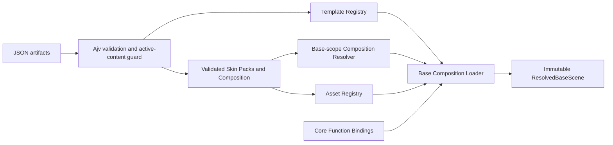

# Base Vertical Slice Foundation

> Architecture status after Contract 1.1: this remains a successful technical
> foundation, compatibility fixture and Core fallback. It is not the target
> granularity for new Room authoring. See
> `13_room_composition_system.md`.

Status: implemented technical foundation
Contract family: Cosmos Theme Engine `1.0.0`
Scope: isolated Base scene resolution; no `BaseView.vue` integration

## 1. Purpose and scope

This implementation provides the typed, validated and testable technical
foundation for the first Base Vertical Slice. It can load a Base Environment
Template, Skin Packs, assets, a User Composition and runtime Function Bindings
and produce an immutable renderable scene model.

It does not:

- mount or modify `BaseView.vue`;
- replace existing Theme Registry/Runtime behavior;
- remove current CSS or graphics;
- implement Theme Builder UI;
- implement Node or Connection theming;
- generate final artwork.

## 2. Implemented files

### 2.1 Runtime modules

| File | Responsibility |
|---|---|
| `frontend/src/theme-engine/types.ts` | Public types corresponding to the five JSON schemas plus runtime-only Function Bindings |
| `frontend/src/theme-engine/validation.ts` | Ajv Draft 2020-12 validation and executable-content rejection |
| `frontend/src/theme-engine/version.ts` | SemVer parsing, comparison and exact/`^`/`~` range checks |
| `frontend/src/theme-engine/templateRegistry.ts` | Versioned Object/Environment Template registration and lookup |
| `frontend/src/theme-engine/assetRegistry.ts` | Atomic asset registration, signatures, MIME/path/hash/SVG checks and fallback |
| `frontend/src/theme-engine/compositionResolver.ts` | Deterministic Base-scope override resolver and trace |
| `frontend/src/theme-engine/baseTemplate.ts` | Canonical `base.main-room.v1` Environment Template |
| `frontend/src/theme-engine/coreDefaultBaseSkin.ts` | Core Default Base Theme/Skin/Composition/Function fixtures |
| `frontend/src/theme-engine/baseCompositionLoader.ts` | End-to-end Base scene loading and cross-artifact validation |
| `frontend/src/theme-engine/index.ts` | Public Theme Foundation API |
| `frontend/src/theme-engine/core-default/assets/base-placeholder.svg` | Minimal internal fallback asset |

`frontend/src/index.ts` re-exports the new API additively. Existing exports and
runtime implementations are unchanged.

### 2.2 Tests

| File | Coverage |
|---|---|
| `validation.test.ts` | valid/invalid artifacts, Object Template, readable errors, executable strings |
| `registries.test.ts` | Template versions/duplicates/missing entries, asset MIME/path/SVG/fallback |
| `compositionResolver.test.ts` | precedence, trace, rejected-value fallback, dependency cycles |
| `baseCompositionLoader.test.ts` | complete scene, required slots, missing assets, bounds separation, free hitboxes, stable Function Bindings |

### 2.3 Contract and dependency changes

- `composition.schema.json` now requires Layout and Effect Bounds for functional
  Scene Nodes.
- `environment-template.schema.json` now permits explicit State Slots on
  Environment asset slots.
- `skin-pack.schema.json` already carries the MIME field consumed by the Asset
  Registry.
- `frontend/package.json` and `pnpm-lock.yaml` add Ajv as the only new runtime
  dependency.

## 3. Data flow

Detailed sequence:

1. JSON input validates without coercion, default injection or unknown-field
   removal.
2. `TemplateRegistry` resolves `base.main-room.v1` against a version range.
3. `AssetRegistry` verifies package-relative paths, format/MIME agreement,
   signatures, byte size, SHA-256 and passive SVG content.
4. `CompositionResolver` selects a compatible Base Skin and records every
   accepted/rejected candidate.
5. `BaseCompositionLoader` joins required slots, surfaces, functional zones,
   Scene Nodes, anchors, bounds, state slots, assets and Core descriptors.
6. The result is data only; nothing is mounted and no Core action is executed.

## 4. New public types

The public API exports:

- `ThemeManifest`, `SkinPack`, `SkinDefinition`;
- `ObjectTemplate`, `EnvironmentTemplate`;
- `Composition`, `EnvironmentScene`, `SceneNode` and all discriminated payloads;
- `BoundsShape`, `BoundsDefinition`, `Anchor`, `TemplateAssetSlot`,
  `TemplateState`;
- `AssetReference`, `AssetBinding`, `VideoMediaContract`;
- `RuntimeDescriptorBinding`, `RuntimeFunctionBinding`;
- `PresentationTarget`, `OverrideAssignment`, `OverrideValue`;
- `ResolvedBaseScene`, `ResolvedBaseSurface`, `ResolvedBaseFunctionalObject`
  and `ResolvedBaseSlot`;
- validation, Registry, Resolver and Loader error/result types.

Serialized types follow the schemas. `RuntimeFunctionBinding` is deliberately
not serializable theme behavior: it is supplied by trusted Core and contains
only stable descriptor identities, never callbacks.

## 5. Canonical Base Template

Identity:

- template ID: `base.main-room.v1`;
- version: `1.0.0`;
- viewport: `1600 × 900 DU`;
- functional fit: `contain`.

Schema IDs remain namespaced. The requested short slot names map as follows:

| Product name | Slot ID |
|---|---|
| `background` | `base.slot.background` |
| `rear-wall` | `base.slot.rear-wall` |
| `left-wall` | `base.slot.left-wall` |
| `right-wall` | `base.slot.right-wall` |
| `floor` | `base.slot.floor` |
| `ceiling` | `base.slot.ceiling` |
| `foreground` | `base.slot.foreground` |
| `ambient` | `base.slot.ambient` |
| `left-door` | `base.slot.left-door` |
| `right-door` | `base.slot.right-door` |
| `left-workspace` | `base.slot.left-workspace` |
| `right-workspace` | `base.slot.right-workspace` |
| `companion` | `base.slot.companion` |

Functional instances use stable zone IDs with the same suffixes. They expose
independent Visual, Interaction, Layout, Effect and, where applicable, Label
Bounds. Bounds live in the Composition and are neither equated nor silently
normalized by the Loader.

The critical `base.zone.exit` is also present because contracts 03/04 and the
Environment schema require a recoverable Base Exit. It has no theme asset slot
and remains Core-owned.

## 6. Resolver order

The implemented Vertical Slice order is:

1. exact Base instance;
2. Room;
3. Environment;
4. global User Composition;
5. active Theme baseline;
6. Core Default.

Within one level:

1. the root Composition precedes parents;
2. higher explicit priority wins;
3. lexical ascending `assignmentId` breaks the final tie.

The Resolver:

- locks a deterministic parent traversal;
- rejects parent cycles;
- exposes winner and rejection reasons;
- can reject unresolved/incompatible values and continue to the next candidate;
- does not implement rule/tag, cluster or project evaluation yet.

Those future scopes are already represented in the public types and schemas.
For a Base target they are explicitly traced as unsupported rather than applied
partially.

## 7. Default fallback

The internal package is:

- pack: `core.skin-pack.base.default@1.0.0`;
- skin: `core.skin.base.default@1.0.0`;
- asset: `core.asset.base.placeholder`.

One neutral, script-free SVG placeholder is intentionally reused for all 13
slots. It exists only to prove complete fallback, asset verification and
render-model construction. It is not intended as final Cosmos artwork.

Fallback occurs at two independent levels:

- missing/incompatible selected Skin candidate → next Resolver candidate, ending
  at Core Default;
- missing selected asset → registered fallback asset, while the resolution
  result records `usedAssetFallback`.

Missing required slot bindings are not corrected and cause
`base_required_slot_missing`.

## 8. Security boundaries

- Themes contain no callbacks or executable modules.
- All artifact schemas have closed fields and are validated with Ajv Draft
  2020-12.
- Validation does not coerce values, inject defaults or remove unknown fields.
- Script/HTML protocols, active elements and event attributes are rejected.
- Asset paths reject absolute paths, schemes, backslashes, empty segments,
  `.`/`..`, queries and fragments.
- File format, kind, MIME and byte signature must agree.
- Byte size and SHA-256 must match before registration.
- SVG rejects scripts, `foreignObject`, embedded HTML, events, external
  references, CSS imports and active URLs.
- Pack asset registration preflights every item and commits only after all
  items pass.
- WebM/MP4 metadata contracts are accepted by the schemas/Registry, but no video
  renderer or playback is implemented.
- Function Bindings originate from Core, are role-checked and expose descriptor
  IDs only.

Ajv `strict` mode remains enabled. `strictRequired` and `strictTypes` diagnostics
are disabled because the schemas intentionally compose root property/type
declarations through conditional subschemas; actual `required`, type and
additional-property validation remains active.

## 9. Test coverage

New coverage: 4 files, 19 tests.

Covered requirements:

- valid Theme, Skin, Object Template, Environment Template and Composition;
- invalid/missing/unknown fields and understandable errors;
- executable-content rejection;
- duplicate and missing Template identities plus version mismatch;
- missing assets and fallback;
- invalid MIME declarations;
- path traversal;
- unsafe SVG content;
- complete Resolver precedence and trace;
- Resolver parent cycles;
- missing required slots;
- freely positioned/scaled Interaction Bounds;
- separation of Visual, Interaction, Layout and Effect Bounds;
- stable and immutable runtime Function Bindings;
- complete Base output with eight surfaces and six functional objects.

At implementation completion the whole frontend suite reports 17 test files and
51 passing tests. TypeScript typecheck and the runtime library production build
also pass.

## 10. Known limitations

- No Base renderer or Vue adapter exists yet.
- No current `BaseView.vue` state is read or migrated.
- Active Theme baseline input is supplied to the Resolver by the caller; a new
  Theme Manifest Registry is outside this slice.
- Selector/tag, cluster and project scopes are typed but not evaluated.
- Only exact, caret and tilde SemVer ranges plus `*` are implemented.
- SVG sanitization is deliberately conservative and rejects rather than rewrites.
- Raster/video dimensions are trusted metadata after signature validation;
  decoder-level dimension verification belongs to the later Resource pipeline.
- Video poster/reference integrity is schema-checked structurally but
  cross-asset validation and playback are deferred.
- The placeholder SVG is technical fallback artwork, not visual design.

## 11. Specification deviations and clarifications

There are no intentional functional deviations from contracts 02–09.

Two additive schema clarifications were necessary to implement requirements
already stated by the contracts:

1. functional Composition Scene Nodes now carry required Layout and Effect
   Bounds in addition to Visual and Interaction Bounds;
2. Environment asset slots may declare their supported State Slots.

Short product slot names are exposed through `BASE_SLOT_IDS` but serialized as
namespaced IDs to preserve the global identifier invariant.

The Base Exit was retained even though it was not repeated in the implementation
request's five-role list, because it is a required critical control in the
governing Template and Environment contracts.

## 12. Next sensible step

This recommendation is superseded by the Room Composition foundation phase.
Before binding anything to `BaseView.vue`, the aggregate must be decomposed into
an architecture-only Room Shell, a reference-only Cosmos Main Room Preset,
Catalog Objects and independent Function Containers.

Historical recommendation, deferred until Phase 9R has passed:

1. consume `ResolvedBaseScene`;
2. render only Core Default surfaces and functional placeholder visuals;
3. keep existing `BaseRuntime` actions and `BaseView.vue` behavior authoritative;
4. run both presenters in screenshot/hitbox parity tests;
5. do not switch production authority until the fallback and Window portal
   gates from Phase 6/8 of the migration plan pass.
