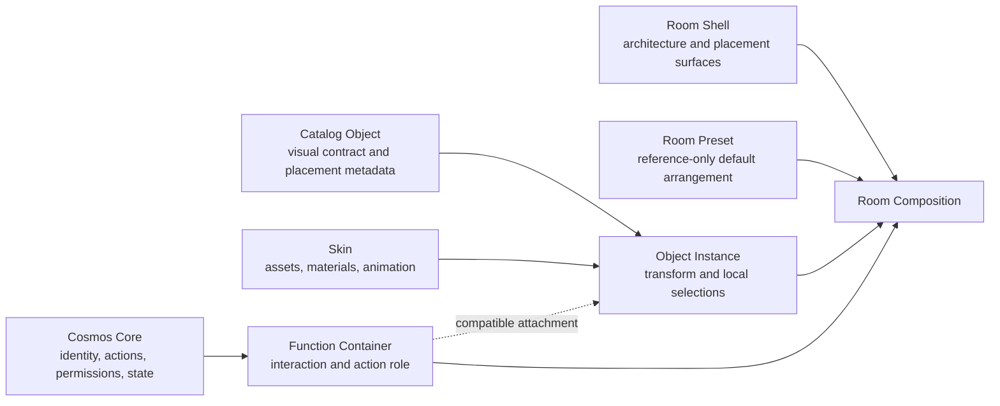

# Room Composition System

**Contract version:** Theme Engine 1.1 architecture addendum
**Status:** normative architecture decision, implementation pending
**Scope:** Room composition, catalog, placement, snapping, builders and migration
**Runtime impact in this phase:** none

## 1. Decision

Cosmos replaces the architectural assumption “a Base is one finished visual
composition” with a modular Room Composition System:

```text
Base
└─ Room instances
   ├─ Room Shell
   ├─ optional Room Preset
   ├─ Object Instances
   ├─ Function Containers
   └─ Decorations
```

A Base is a persistent collection and connection graph of Rooms. A Room is a
composition over one Room Shell. The Shell contains only architecture and
placement semantics. Furniture, Doors, Workspaces, Companion presentation,
lights, plants and decoration are catalog Object Instances.

The existing `base.main-room.v1` Vertical Slice remains a successful,
non-breaking compatibility prototype. It is no longer the target granularity
for new templates.

## 2. Goals and non-goals

### 2.1 Goals

- radically different Rooms can reuse the same object catalog;
- one Room Shell can support many presets and user arrangements;
- catalog objects can be placed without duplicating assets;
- visual presentation can change without changing function;
- placement and snapping are semantic instead of grid-first;
- user-edited instances survive Theme, preset and catalog changes;
- Theme Builder and Base Builder have non-overlapping authority;
- the current Theme Engine resolver and fallback principles remain valid.

### 2.2 Non-goals

This decision does not:

- migrate `BaseView.vue`;
- change current Runtime behavior;
- implement a Builder UI;
- implement new assets;
- define arbitrary executable object behavior;
- replace existing override precedence;
- silently reinterpret current user data.

## 3. Architectural vocabulary

| Term | Definition |
|---|---|
| Base Composition | Persistent Room collection, Room connection graph and Base-level presentation selections. |
| Room Instance | One persistent Room identity inside a Base. |
| Room Shell | Function-free architectural Template describing geometry, placement surfaces, camera and layers. |
| Room Preset | A reference-only default arrangement of catalog objects for a compatible Room Shell. |
| Catalog Object | A reusable object definition with family, bounds, placement metadata, compatible Skins and optional Function Container compatibility. |
| Object Instance | One placed reference to a Catalog Object inside a Room. |
| Function Container | Core-owned functional contract independently attached to a compatible Object Instance. |
| Decoration | Pointer-passive Object Instance without a Function Container. |
| Placement Surface | Shell-published logical surface such as floor, wall or ceiling. |
| Placement Area | Bounded allowed region on a Placement Surface. |
| Placement Anchor | Named socket on a Shell or Object Instance. |
| Placement Binding | Persisted relation between an Object Instance and its selected Surface/Area/Anchor. |
| Instance Customization | Per-property user-authored values and inheritance locks for one Object Instance. |

## 4. Separation of responsibilities



The boundaries are normative:

- a graphic never owns a function;
- a Skin never owns an action, route, capability or permission;
- a Function Container never owns theme artwork;
- a Room Preset never embeds or duplicates assets;
- a Room Shell never contains furniture, Doors, Workspaces, Companion,
  decoration or Function Containers;
- a Base Builder never edits Templates, Skins or source assets;
- a Theme Builder never mutates a user's Base or Room instances.

## 5. Base Composition

A Base Composition owns:

- immutable `baseId`;
- ordered Room identities;
- one optional entry Room;
- typed Room connection records;
- Base-level presentation selections;
- Room Preset application history;
- revision and migration metadata.

Conceptual contract:

```ts
interface BaseComposition {
  schemaVersion: 1;
  baseId: string;
  rooms: readonly RoomInstance[];
  connections: readonly RoomConnection[];
  entryRoomId?: string;
  presentationOverrides: readonly OverrideAssignment[];
  revision: Revision;
}
```

Room connections are Core domain data. A Door Object may visualize a
connection, but deleting or reskinning the Door does not silently delete or
retarget the connection.

## 6. Room Shell

### 6.1 Purpose

A Room Shell describes only the spatial and architectural chassis of a Room.
It owns:

- reference viewport and Design Units;
- room boundary and architecture geometry;
- floor, wall and ceiling Placement Surfaces;
- background openings;
- perspective and camera metadata;
- lighting anchors, not lamp artwork;
- Placement Areas and Anchors;
- semantic layer bands;
- safe areas and navigation clearances;
- responsive mapping;
- Core fallback architecture.

It contains no:

- Door instance;
- Workspace furniture;
- general furniture;
- plant;
- lamp asset;
- Companion visual;
- decoration;
- Function Container;
- action binding.

### 6.2 Conceptual data model

```ts
type PlacementSurfaceKind =
  | "floor"
  | "wall"
  | "ceiling"
  | "background-opening"
  | "architecture"
  | "object-anchor";

interface RoomShellTemplate {
  schemaVersion: 1;
  shellId: string;
  version: string;
  referenceViewport: ReferenceViewport;
  camera: RoomCameraContract;
  architectureSurfaces: readonly ArchitectureSurface[];
  placementSurfaces: readonly PlacementSurface[];
  placementAreas: readonly PlacementArea[];
  placementAnchors: readonly PlacementAnchor[];
  lightAnchors: readonly LightAnchor[];
  safeAreas: readonly SafeArea[];
  layerBands: readonly LayerBand[];
  fallbackShellRef: VersionedRef;
}
```

### 6.3 Camera and perspective

Camera metadata is declarative:

- projection family: `orthographic`, `perspective`, or trusted
  `illustrated-fixed`;
- camera angle and horizon;
- surface normals in Room Design Space;
- depth mapping policy;
- scale reference;
- responsive profiles.

Skins may stylize perceived depth but cannot change placement geometry or
camera semantics. A new topology or incompatible perspective requires a new
Room Shell major version, not a Skin workaround.

### 6.4 Placement surfaces

Every Placement Surface has:

- stable `surfaceId`;
- `surfaceKind`;
- geometry and normal;
- local coordinate basis;
- allowed Placement Areas;
- collision boundary;
- semantic layer band;
- optional edge and corner Anchors;
- optional support load/category metadata;
- deterministic snap priority.

Surface geometry is function-free and pointer-passive.

## 7. Room Preset

### 7.1 Purpose

A Room Preset is a default furnishing recipe. For example, “Cosmos Main Room”
may reference:

- one left Door Object;
- one right Door Object;
- two Workspace Furniture Objects;
- one Companion presentation Object;
- lamp Objects;
- plant Objects;
- decorative Objects.

The preset contains only versioned references and default placement blueprints.
It never copies PNG, WebP, SVG, video or material data.

### 7.2 Conceptual data model

```ts
interface RoomPreset {
  schemaVersion: 1;
  presetId: string;
  version: string;
  compatibleShells: readonly VersionedRef[];
  objectPlacements: readonly PresetObjectPlacement[];
  functionAttachments: readonly PresetFunctionAttachment[];
  surfaceMaterialRefs: readonly PresetSurfaceMaterialBinding[];
  fallbackPolicy: "omit-optional" | "core-default";
}

interface PresetObjectPlacement {
  presetItemId: string;
  catalogObjectRef: VersionedRef;
  defaultSkinRef?: VersionedRef;
  placementIntent: PlacementIntent;
  transform: PlacementTransform;
  optional: boolean;
}
```

`presetItemId` is stable across compatible preset revisions. It is the
three-way-merge identity and must never be derived from array position.

### 7.3 Applying and updating presets

First application creates Object Instances with new immutable instance IDs and
records their originating `presetId`, version and `presetItemId`.

Reapplying or upgrading a preset uses a three-way comparison:

```text
old preset baseline
vs. user instance state
vs. new preset baseline
```

Rules:

- unchanged inherited properties may accept the new preset value;
- user-pinned properties remain unchanged;
- newly added preset items may be offered or added according to explicit user
  choice;
- removed but user-customized items become detached user instances;
- removed and untouched items may be removed only through an explicit preset
  update transaction;
- no preset operation silently changes a Function Container target.

## 8. Catalog Objects

### 8.1 Required families

The catalog architecture initially reserves:

| Family | Typical placement | Function compatibility |
|---|---|---|
| Door | wall plus floor contact | Room Transition |
| Workspace Furniture | floor, optional wall preference | Workspace |
| Furniture | floor, wall preference or object anchor | usually none |
| Decoration | floor, wall or object anchor | none |
| Plant | floor or furniture anchor | none |
| Light | wall, ceiling, floor or furniture anchor | trusted light presentation only |
| Surface Material | compatible architecture Surface | none |
| Window | wall/background opening | optional navigation/view role in future |
| Architecture Object | architecture/floor/wall | none by default |

These are catalog families, not behaviors. A Door graphic without a Room
Transition Function Container is decorative architecture. A Workspace
Furniture graphic without a Workspace Function Container does not open a
Workspace.

Surface Material is the one non-spatial catalog family. It uses a specialized
`SurfaceMaterialDefinition` and a Room Surface binding rather than
`CatalogObjectTemplate`, Object Instance, transform or collision bounds.

### 8.2 Conceptual data model

```ts
interface CatalogObjectTemplate {
  schemaVersion: 1;
  objectTemplateId: string;
  version: string;
  family: CatalogObjectFamily;
  bounds: {
    layout: BoundsShape;
    visual: BoundsShape;
    effect: BoundsShape;
    label?: BoundsShape;
  };
  pivot: Point;
  placementProfile: PlacementProfile;
  skinCompatibility: SkinCompatibility;
  functionContainerCompatibility?: readonly FunctionContainerRole[];
  layerCompatibility: readonly string[];
  coreFallbackSkinRef: VersionedRef;
}
```

Catalog definitions own no asset bytes. Skins and Asset Registry continue to
own visual resources. Multiple presets and Rooms can reference the same
Catalog Object and Skin without duplication.

### 8.3 Object Instances

```ts
interface RoomObjectInstance {
  instanceId: string;
  catalogObjectRef: VersionedRef;
  placementBinding: PlacementBinding;
  transform: PlacementTransform;
  layerBand: string;
  skinSelection: InheritableSelection<VersionedRef>;
  animationSelection: InheritableSelection<VersionedRef>;
  functionContainerInstanceId?: string;
  customization: InstanceCustomization;
  origin?: PresetOrigin;
}
```

An instance stores references, placement and local choices. It does not copy
the Catalog Object, Skin or Function Container definition.

## 9. Function Containers

### 9.1 Decision

A function belongs to a Function Container, never to graphics.

Example:

```text
Knowledge Workspace Function Container
├─ Skin: Computer terminal
├─ Skin: Bookshelf
├─ Skin: Magic table
└─ Skin: Enchanting table
```

All four visuals may represent the same Workspace function. Changing the Skin
does not change Workspace identity, action role, target, permission or
Interaction Bounds.

### 9.2 Ownership

A Function Container owns:

- stable functional role;
- Core descriptor compatibility;
- Interaction Bounds or their Template reference;
- activation and accessibility semantics;
- minimum target and clearance requirements;
- Core state slots;
- attachment compatibility;
- required fallback presentation role.

Cosmos Core supplies:

- descriptor instance;
- represented/target Object identity;
- availability;
- authorization;
- action dispatch;
- accessible name source.

The attached Catalog Object and Skin own:

- Visual Bounds;
- Effect Bounds;
- artwork;
- materials;
- declarative animation presentation.

### 9.3 Conceptual data model

```ts
interface FunctionContainerDefinition {
  containerRole: FunctionContainerRole;
  compatibleCatalogFamilies: readonly CatalogObjectFamily[];
  actionRole: CoreActionRole;
  interactionContract: InteractionContract;
  requiredClearance: BoundsShape;
  states: readonly TemplateState[];
  fallbackPresentationRef: VersionedRef;
}

interface FunctionContainerInstance {
  containerInstanceId: string;
  definitionRef: VersionedRef;
  attachedObjectInstanceId: string;
  descriptorBinding: RuntimeDescriptorBinding;
  interactionTransform: PlacementTransform;
}
```

Distributable presets store only expected descriptor roles. Ephemeral
descriptor IDs and local target IDs are resolved by Runtime context.

### 9.4 Attachment rules

- attachment is an atomic validated operation;
- Catalog Object family and container role must be compatible;
- the Object's Placement Binding must satisfy container clearance;
- the Interaction transform derives from the Object Instance Placement Binding
  plus a container-local attachment transform, never from painted pixels;
- scaling follows the Function Container scale policy and can never reduce the
  effective target below its Core minimum;
- one visual instance cannot accidentally dispatch multiple primary actions;
- detaching the function leaves the graphic as a decorative instance unless
  the preset marks the function as required;
- deleting a required functional visual triggers Core fallback, not deletion
  of the represented domain Object;
- a Theme change can change the attached Skin but not the attachment.

## 10. Placement System

### 10.1 Principle

Placement is metadata-driven constraint resolution. The system first finds
semantically valid surfaces and Anchors, then chooses the best placement among
them. A grid is optional precision assistance, never the primary model.

### 10.2 Placement Profile

```ts
interface PlacementProfile {
  allowedSurfaceKinds: readonly PlacementSurfaceKind[];
  requiredContacts: readonly ContactRequirement[];
  allowedAnchorRoles: readonly string[];
  orientationPolicy: OrientationPolicy;
  wallPolicy?: "required" | "preferred" | "avoid";
  floorContact?: "required" | "preferred" | "none";
  collisionPolicy: "solid" | "soft" | "overlap-allowed";
  clearanceBounds?: BoundsShape;
  scaleRange: { minimum: number; maximum: number };
  rotationPolicy: RotationPolicy;
  snapPriorities: readonly SnapTargetKind[];
}
```

Examples:

| Object | Allowed placement metadata |
|---|---|
| Table | floor; wall optional; solid Layout Bounds |
| Door | wall required; floor contact required; align to wall normal |
| Ceiling Light | ceiling; align to surface normal |
| Wall Light | wall; optional vertical offset range |
| Picture | wall; keep inside wall Placement Area |
| Plant | floor or compatible furniture Anchor |
| Monitor | Workspace Anchor; face Workspace interaction direction |

### 10.3 Hard constraints and soft preferences

Hard constraints cannot be bypassed by ordinary dragging:

- compatible surface kind;
- required contact;
- minimum/maximum scale;
- Room boundary;
- critical safe area;
- Function Container clearance;
- forbidden collision;
- immutable Shell geometry.

Soft preferences may be temporarily disabled:

- wall alignment for general furniture;
- center/edge alignment;
- equal spacing;
- visual grouping;
- optional grid;
- aesthetic clearance.

### 10.4 Placement Binding

The persisted result records semantic attachment, not only world coordinates:

```ts
interface PlacementBinding {
  surfaceId: string;
  placementAreaId: string;
  anchorId?: string;
  localPosition: Point;
  normalOffset: number;
  orientationMode: "surface-normal" | "room" | "custom";
  shellVersion: string;
}
```

The numeric Room transform is also persisted for deterministic rendering.
Binding metadata supports diagnostics and explicit migration. A Shell update
never silently reprojects an instance to a different Surface.

## 11. Intelligent Snap System

### 11.1 Candidate pipeline

For every drag proposal, the snap engine:

1. filters compatible Placement Surfaces and Areas;
2. evaluates required contacts;
3. gathers compatible Shell and Object Anchors;
4. clamps Layout Bounds to Room boundaries;
5. rejects hard collisions and clearance violations;
6. calculates surface-normal orientation;
7. scores logical edges, centers, sockets and spacing;
8. optionally adds grid candidates;
9. applies hysteresis to avoid flicker;
10. returns the winning candidate plus reasons.

### 11.2 Deterministic score

Candidates are ordered by:

1. hard validity;
2. explicit Anchor/socket match;
3. required contact quality;
4. object-declared snap priority;
5. pointer distance within the magnetic threshold;
6. alignment quality;
7. collision clearance;
8. previous snap target hysteresis;
9. stable target ID lexical tie-break.

The score and rejection reasons are exposed through a read-only trace. DOM
order, frame timing and asset pixels never influence the winner.

### 11.3 Expected behavior

- furniture stops at walls because its Layout Bounds are clamped to the floor
  Placement Area;
- Doors snap to wall segments and keep required floor contact;
- wall and ceiling lights align to the selected surface normal;
- pictures stay inside a wall Placement Area;
- plants can select a floor or compatible furniture Anchor;
- monitors select a Workspace Anchor;
- optional grid snapping refines an already valid semantic placement.

### 11.4 Placement feedback contract

Future Builder UI must expose, without prescribing visual branding:

- a ghost preview at the resolved position;
- valid/invalid state;
- active Surface/Anchor;
- hard-constraint reason;
- snap reason;
- collision/clearance outline;
- a temporary soft-snap bypass;
- an explicit repair action for invalid persisted placements.

The UI must not hide automatic rotation, clamping or reparenting.

## 12. Override behavior

### 12.1 Existing precedence remains

The resolver order remains:

1. exact instance;
2. selection rule;
3. cluster;
4. project;
5. room;
6. environment;
7. global User Composition;
8. active Theme;
9. Core Default.

The refinement is per-property inheritance for Room Object Instances.

### 12.2 Protected user customizations

At minimum, an individually edited instance can pin:

- position;
- rotation;
- scale;
- Skin;
- animation selection.

```ts
type InheritanceMode = "inherit" | "pinned" | "reset-to-parent";

interface InstancePropertyValue<T> {
  mode: InheritanceMode;
  value?: T;
  authoredAgainst: ResolutionOrigin;
}

interface InstanceCustomization {
  position: InstancePropertyValue<Point>;
  rotation: InstancePropertyValue<number>;
  scale: InstancePropertyValue<Point>;
  skin: InstancePropertyValue<VersionedRef>;
  animation: InstancePropertyValue<VersionedRef>;
}
```

An active Theme change supplies new values only to properties in `inherit`
mode. It cannot overwrite a `pinned` value. `reset-to-parent` is an explicit
user command that removes the local pin and immediately resolves the parent
chain.

### 12.3 Preset and Theme updates

- Theme activation never changes instance transform pins.
- Theme activation never changes a pinned Skin or animation selection.
- Room-level overrides affect only inherited instance channels.
- Preset reapplication uses the three-way merge described in section 7.3.
- Catalog patch/minor updates cannot reinterpret placement metadata
  incompatibly.
- Incompatible Shell or Catalog major versions require an explicit migration.
- If a pinned placement becomes invalid, Cosmos preserves the last valid data,
  marks the instance `needs-placement-repair`, and does not guess a new
  position.

Function Container attachment, action role and target are not presentation
override channels.

## 13. Base Builder

There is no separate Room Builder.

Base Builder owns:

- Room creation, deletion, ordering and selection;
- Room Shell selection from the catalog;
- Room connections;
- catalog browsing;
- Object Instance placement;
- furnishing and decoration;
- Function Container attachment to available Core descriptors;
- Room Preset creation, application and update;
- instance customization and reset-to-inherited commands;
- placement, collision and migration diagnostics.

Base Builder does not:

- create or edit source assets;
- author Templates;
- author Skins or materials;
- author animation definitions;
- sanitize/import Art Pack source files;
- modify Core action definitions;
- write arbitrary Renderer parameters.

## 14. Theme Builder

Theme Builder owns:

- Room Shell Templates;
- Catalog Object Templates;
- Skins;
- materials and tokens;
- declarative animation definitions;
- asset import, validation and management;
- Art Pack import/export;
- compatibility metadata;
- Core fallback completeness;
- catalog package publication.

Theme Builder may preview objects in fixture Rooms, but the fixture is not a
user Base and cannot be exported as a live Function Container binding.

Theme Builder does not:

- manage Rooms in a Base;
- place persistent user Object Instances;
- edit Room connections;
- attach local Runtime descriptors;
- overwrite instance customizations;
- act as Base Builder.

## 15. Design Intelligence

The review follows
`docs/Product_Bible_V2/00_Foundation/06_Design_Intelligence.md`: Cosmos learns
from solved interaction problems without copying UI, branding or workflows.

### 15.1 Comparable systems

| System | Observed principle | Evidence |
|---|---|---|
| The Sims | Catalog-driven Build Mode, direct movement, rotation and scaling make room creation approachable. | [EA Build Mode guide](https://www.ea.com/en/games/the-sims/the-sims-4/new-player-hub/build-mode) |
| Animal Crossing | A furnishing catalog, immediate preview and object-on-object placement make decoration low-friction and playful. | [Nintendo Happy Home Designer manual](https://csassets.nintendo.com/noaext/image/private/t_KA_PDF/manual-3DS-animal-crossing-happy-home-designer-en?_a=DATC1RAAZAA0), [Happy Home Paradise](https://animalcrossing.nintendo.com/new-horizons/happy-home-paradise/) |
| House Flipper | Room-scale renovation combines a broad object catalog with strong physical context and task clarity. | [Official House Flipper overview](https://www.houseflippergame.com/index.html) |
| Stardew Valley | Simple valid/invalid placement feedback and lightweight rotation support relaxed customization. | [Stardew Valley furniture documentation](https://wiki.stardewvalley.net/Furniture) |
| Blender | Different snap targets, pivots and optional rotation-to-target show that snapping should be typed and contextual. | [Blender snapping manual](https://docs.blender.org/manual/de/2.80/scene_layout/object/editing/transform/control/snap.html) |
| Figma | Smart object alignment, visible guides and temporary snap bypass preserve speed without forcing a grid. | [Figma alignment and snapping](https://help.figma.com/hc/en-us/articles/360039956914-Adjust-alignment-rotation-and-position) |
| Unreal Engine | Surface, grid and vertex snapping; surface normals and offsets separate semantic attachment from precision increments. | [Unreal Engine Actor Snapping](https://dev.epicgames.com/documentation/unreal-engine/actor-snapping-in-unreal-engine?lang=en-US) |

### 15.2 Adopted principles

- catalog-first discovery instead of asset-file browsing;
- immediate placement preview and reversible direct manipulation;
- object-declared placement restrictions;
- typed Surface, Anchor and object snap targets;
- surface-normal alignment and explicit offset;
- stable pivots and independent transform channels;
- visible validity, collision and snap reasons;
- optional grid as a secondary precision tool;
- reusable presets that reference catalog items;
- low-friction decoration without weakening functional invariants.

### 15.3 Intentionally rejected

- grid-first placement as the universal model;
- hidden cheats or modifier-only access to basic free placement;
- fixed 90-degree rotation for every object;
- gameplay economy, inventory scarcity or progression gates in the Builder;
- first-person-only precision placement;
- professional mesh/vertex complexity in the default workflow;
- raw coordinate editing as the primary interaction;
- copying any reference application's UI layout, icons, branding or visual
  language;
- deriving collision or function from painted pixels.

### 15.4 Why Cosmos differs

Cosmos combines the approachable catalog and preview model of room-building
games with the typed surfaces, Anchors and transform rigor of professional
editors. It adds two properties the reference systems do not jointly optimize:

1. visual objects and Function Containers are independently replaceable;
2. instance property provenance protects user edits across global Theme and
   preset changes.

This better fits the Cosmos vision because one functional Workspace can become
a terminal, bookshelf, magic table or game-inspired object without changing
the user's Knowledge Workspace, and because personal Room arrangements remain
stable while the surrounding visual world evolves.

### 15.5 Hidden usability risks

- too many snap candidates can make objects jump unpredictably;
- invisible hard constraints can feel broken;
- automatic surface-normal rotation can surprise users;
- catalog family and function terminology can become technical;
- preset updates can destroy trust if their merge is not explicit;
- free scaling can create inaccessible Function Container targets;
- wall/floor contact rules can conflict at corners;
- invalid placements after Shell upgrades need a recoverable holding state;
- a large catalog requires search, filters, favorites and recent items later,
  without changing the data contract.

Mitigations are deterministic scoring, hysteresis, a placement trace,
explainable previews, explicit pin/reset controls and transactional preset
updates.

## 16. Differences from the previous Base architecture

| Previous Vertical Slice | Room Composition System |
|---|---|
| one `base.main-room.v1` Environment Template | Base contains Room Instances |
| Shell surfaces and functional objects in one template | Room Shell contains architecture only |
| Doors and Workspaces are fixed template zones | Doors and Workspace Furniture are Catalog Objects |
| Companion is a fixed Base node | Companion presentation is a placeable compatible Object |
| one Base scene Composition | one Base graph plus independent Room Compositions |
| Base template is primary Art Pack | Shell and Catalog Objects have independent Art Packs |
| functional role coupled to functional scene node | Function Container attaches independently to graphics |
| Theme Builder authors the assembled Base | Theme Builder authors catalog; Base Builder assembles Rooms |
| preset-like layout embedded in canonical composition | Room Preset is reference-only and mergeable |

## 17. Compatibility disposition of `base.main-room.v1`

The existing implementation remains:

- a test fixture for registries, assets, validation and exporter determinism;
- a Core Default fallback during migration;
- a source for extracting the first Room Shell and Room Preset;
- an adapter input for current Art Pack exports;
- non-authoritative for new Room architecture.

Migration mapping:

| Existing element | New owner |
|---|---|
| Background, rear/left/right walls, floor, ceiling | Room Shell architecture |
| Surface bounds and layer bands | Room Shell |
| Door visuals | Door Catalog Object Instances |
| Workspace visuals | Workspace Furniture Object Instances |
| Companion visual | Companion Catalog Object Instance |
| Door/Workspace/Companion actions | Function Containers |
| Foreground decoration | Preset decoration or Shell architecture only when structurally required |
| Ambient visual | preset decoration/material/ambient renderer; Shell keeps only light Anchors |
| Base Exit | Application Shell/Base navigation layer outside the Room Shell |

## 18. Impact on existing contracts

| Contract | Impact |
|---|---|
| `02_theme_engine_contract.md` | Core/Template/Skin separation remains; Room Shell, Preset, Catalog Object, Function Container and Base Builder terms are added. |
| `03_template_catalog.md` | The aggregate Base Template becomes a compatibility entry; new canonical catalog families and architecture-only Shells are introduced. |
| `04_environment_composition_contract.md` | Scene invariants remain; the Room authoring unit becomes Shell plus instances plus Function Containers. |
| `05_asset_and_skin_contract.md` | Media/security rules remain unchanged; Skins target Shell/Object visuals and cannot target functions. |
| `06_override_resolution_contract.md` | Scope order remains unchanged; exact-instance resolution gains per-property provenance and pins. |
| `07_renderer_contract.md` | Trusted rendering remains unchanged; Function Container descriptors are explicitly excluded from render parameters. |
| `08_theme_builder_contract.md` | Catalog authoring stays in Theme Builder; live Room assembly moves to the sole Base Builder. |
| `09_migration_plan.md` | Mandatory Phase 9R is inserted before Builder UI or Runtime migration. |
| `10_base_vertical_slice_foundation.md` | Retained as test fixture, fallback and decomposition source. |
| `11_base_template_exporter.md` | Existing Base export remains a compatibility Art Pack. |
| `12_art_pack_exporter.md` | Generic adapter direction remains; next adapters split Room Shell and Catalog Object exports. |
| JSON Schemas and TypeScript types | Deliberately unchanged in this documentation-only phase; new schema work is the next implementation gate. |

## 19. Migration recommendation

### Phase A — Contract and schema design

- add schemas for Room Shell, Room Preset, Catalog Object, Function Container,
  Room Composition and Base Composition;
- add stable placement metadata and instance property provenance;
- version the Environment Composition contract to 1.1;
- keep current schemas readable.

### Phase B — Registry and resolver foundation

- add Shell, Catalog Object, Preset and Function Container registries;
- extend resolution traces with per-property inheritance mode;
- implement preset three-way-merge as a pure tested module;
- implement placement candidate and snap trace types without UI.

### Phase C — Compatibility decomposition

- build a read-only adapter from `base.main-room.v1`;
- emit one synthetic Room Shell;
- emit one `Cosmos Main Room` Preset;
- map five functional visuals to Catalog Object references;
- map their behavior to Function Containers;
- compare the resolved compatibility scene byte-for-byte or geometrically
  against the current Base Scene model.

### Phase D — Exporters

- export Room Shell Art Packs independently;
- export Catalog Object Art Packs independently;
- export Room Presets as reference-only manifests and optional assembled
  previews;
- never treat the assembled preset preview as a new asset source.

### Phase E — Builder domain layer

- implement Base Builder commands and persistence without replacing Runtime;
- implement semantic placement and snapping as pure deterministic services;
- add undo/redo and explicit preset update transactions;
- add fixture-based accessibility and clearance validation.

### Phase F — Runtime migration

- keep `BaseView.vue` unchanged until all earlier gates pass;
- load compatibility Room Composition beside the existing path;
- compare function, bounds, layer and state traces;
- activate behind a per-component compatibility switch;
- retain the current Base fallback until full parity and rollback tests pass.

## 20. Required future tests

- Room Shell rejects functional Objects and asset duplication;
- Preset contains references only;
- every catalog family validates its Placement Profile;
- Function Container remains stable across four incompatible-looking Skins;
- attach/detach is atomic and role-compatible;
- Door requires wall plus floor contact;
- ceiling/wall lights align to correct normals;
- furniture clamps at Room boundaries;
- optional grid never overrides semantic invalidity;
- snap result is deterministic under randomized candidate order;
- snap hysteresis prevents threshold flicker;
- instance position, rotation, scale, Skin and animation pins survive Theme
  activation;
- inherited properties accept Theme changes;
- preset three-way merge preserves user edits;
- Shell major upgrade never silently relocates an instance;
- Base connection identity survives Door reskin/delete fallback;
- compatibility adapter preserves current Base geometry and Function Bindings.

## 21. Risks

| Risk | Impact | Mitigation |
|---|---|---|
| Too many artifact kinds | authoring and Registry complexity | small canonical catalog, shared version/reference primitives |
| Placement metadata inconsistency | unpredictable Builder behavior | family conformance suites and Core defaults |
| Shell fragmentation | incompatible presets and objects | topology-based major versions and compatibility declarations |
| Preset merge ambiguity | loss of user trust/data | stable item IDs, property provenance and previewed transaction |
| Function/visual mismatch | confusing or inaccessible action | compatibility contract, clearance validation and Core fallback |
| Snap instability | frustrating direct manipulation | deterministic score, threshold, hysteresis and trace |
| Free placement harms accessibility | unreachable targets | Function Container minimum target and approach clearance |
| Migration duplicates authority | divergent scenes | read-only adapter, parity fixtures and one activation owner |
| Catalog scale | discovery and performance problems | indexed metadata, lazy previews and budgets |

## 22. Next implementation phase

The next phase should implement only the new data contracts, JSON Schemas and
pure validation/placement types. It should not build either Builder UI or
change `BaseView.vue`.

The first executable proof should decompose `base.main-room.v1` into:

1. one Room Shell fixture;
2. one `Cosmos Main Room` Room Preset;
3. Door, Workspace Furniture and Companion Catalog Object fixtures;
4. Room Transition, Workspace and Companion Function Container fixtures;
5. one resolved compatibility Room scene equal to the existing Base Vertical
   Slice.

That proof validates the architecture while preserving the successful
technical foundation and all current Runtime behavior.
